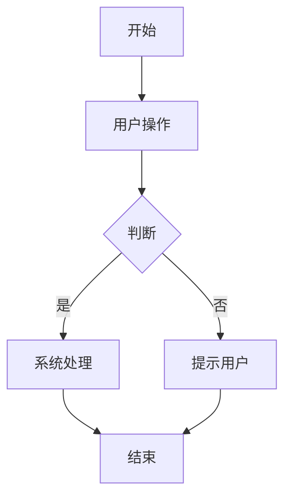

# PRD Skill

This skill manages Product Requirement Documents (PRD) for each frontend route/page in a project. It automatically updates PRD content when code changes are made during development.

## /prd 一键启动（全自动）

当用户输入 `/prd` 时，执行以下命令：

```bash
node ~/.claude/skills/prd/start-prd.js npm run dev
```

自动完成：
1. 智能找项目根目录和 HTML 入口
2. 自动注入 PRD 悬浮按钮到页面
3. 启动 PRD 后端服务（端口 3001）
4. 启动项目 dev server

**无需手动配置，无需判断框架，无需修改项目代码。**

完成后告知用户：打开项目页面，左下角有 [PRD] 按钮，点击自动加载当前页面文档。

---

## GitHub Pages 部署（静态部署）

运行 `/prd` 时，会自动构建 `public/prd-data.js`，此文件包含所有 PRD 内容。

**部署步骤：**
1. 运行 `node ~/.claude/skills/prd/start-prd.js` 后，`public/prd-data.js` 已自动生成
2. 将 `public/prd-data.js` 和 `public/prd-inject.js` 提交到 Git 仓库
3. 在 GitHub Pages 中启用部署
4. 访问 `https://username.github.io/repo/` 即可看到 PRD 按钮（无需服务）

**数据源优先级：**
```
1. window.__PRD_DATA__（HTML 内嵌）最高
2. /prd-data.js（静态文件）次之
3. /prd/_index.md（服务提供）再次
4. http://localhost:3004 API（开发模式）最低
```

**注意：** 静态模式下，双击编辑功能不可用。如需编辑，运行 `/prd` 启动开发服务。

---

## PRD 章节顺序（固定结构）

所有 PRD 必须按以下顺序组织章节，不可调换顺序：

```
1. 需求背景
2. 用户故事
3. 需求清单
4. 业务流程图
5. 页面结构
6. 功能描述
7. 数据流图
8. 验收标准
9. 更新记录
```

---

## 字段级书写原则

**功能描述章节必须细化到字段级别，不可只写页面级描述。**

每个字段必须包含以下 8 个属性：

| 属性 | 说明 |
|------|------|
| **字段名称** | 具体的英/中文变量名或 UI 标签 |
| **类型** | 文本/数字/布尔/枚举/日期/文件/关联ID |
| **必填** | 是 / 否 |
| **默认值** | 未填写时的初始值 |
| **来源** | 用户输入 / 系统生成 / 接口返回 / 计算得出 |
| **校验规则** | 非空 / 长度限制 / 格式正则 / 范围限制 |
| **展示形式** | 输入框 / 下拉选择 / 日期控件 / 开关 / 标签 / 头像 / 进度条 |
| **交互约束** | 只读 / 可编辑 / 提交后锁定 / 关联联动字段 |

---

## 1. 需求背景

```markdown
## 需求背景

### 痛点
- **问题现象**：当前业务中用户遇到的具体问题描述
- **发生频率**：该问题出现的频率或影响面（高/中/低）
- **当前 workaround**：目前用户如何绕过这个问题

### 业务目标
- **量化指标**：上线后预期达成的数字指标（如转化率提升X%、加载时间<2s）
- **目标期限**：业务目标的达成时间节点

### 涉及系统/模块
- **模块名称**：本次需求涉及的系统或模块名
- **变更类型**：新增/修改/删除/对接
- **对接接口**：涉及哪些接口或数据协议
```

## 2. 用户故事

```markdown
## 用户故事

### 故事1
- **角色**：具体人员角色（最终用户/管理员/运营），不能是泛称
- **功能**：用户想要完成的具体操作
- **收益**：完成后能给用户带来什么可量化的价值
- **验收条件**：如何验证这个故事已完成

### 故事2
...

### 故事3
...
```

## 3. 需求清单

```markdown
## 需求清单

| 序号 | 需求描述 | 优先级 | 状态 | 负责人 | 截止日期 |
|------|----------|--------|------|--------|----------|
| 1    | 实现{功能} | P0 | TODO | | |
| 2    | 对接{接口} | P1 | TODO | | |

- **优先级**：P0（核心流程阻塞）/ P1（重要功能）/ P2（体验优化）/ P3（未来规划）
- **状态**：TODO / IN PROGRESS / DONE / BLOCKED
- **负责人**：具体人员姓名或角色
- **截止日期**：YYYY-MM-DD 格式
```

---

## 4. 业务流程图

```markdown
## 业务流程图



- 每个节点对应一个具体操作步骤
- 判断节点描述分支条件
- 异常路径单独列出
- **面板内直接渲染为 SVG，无需额外操作**
```

---

## 5. 页面结构

```markdown
## 页面结构

### 路由信息
- **路由路径** - 类型：文本；必填：是；示例：`/user/profile`
- **页面标题** - 类型：文本；必填：是；示例：`个人中心`
- **访问权限** - 类型：枚举（公开/登录/角色）；描述：该页面的访问控制要求

### 布局结构
- **布局类型** - 类型：枚举（单栏/双栏/三栏）；描述：整体布局方式
- **区域-顶部栏** - 字段列表；描述：Logo/搜索框/通知/头像各是什么字段
- **区域-侧边栏** - 字段列表；描述：菜单项的图标/名称/路由字段
- **区域-主内容** - 字段列表；描述：主内容区由哪些区块字段组成

### Tab 结构（如有）
- **Tab名称** - 类型：文本；必填：是；示例：`基本信息`
- **Tab路由** - 类型：文本；描述：切换到该 Tab 的 URL 参数
- **加载方式** - 类型：枚举（预加载/懒加载/keep-alive）
- **默认激活** - 类型：布尔；描述：首次进入时是否默认激活
```

---

## 6. 功能描述（字段级）

**每个功能点根据实际情况选择性包含以下层级：页面级（必须有）、Tab级（有 Tab 时）、弹窗级（有弹窗时）。只有 Tab 才有查询条件字段。**

```markdown
## 功能描述

### 功能点1：{功能名称}

#### 页面级
- **字段：功能入口** - 类型：文本；描述：从页面哪个位置进入（按钮/链接/右键菜单）
- **字段：前置条件** - 类型：文本；描述：进入该功能前需要满足的条件（如已登录/已选择数据）
- **字段：后置影响** - 类型：字段列表；描述：操作成功后会影响页面哪些字段的展示值

#### Tab 级（有 Tab 时才写）
- **Tab名称** - 类型：文本；示例：`基础配置`
- **查询条件字段**（有查询条件时才写）：
  | 字段名 | 类型 | 必填 | 默认值 | 来源 | 校验规则 | 展示形式 | 交互约束 |
  |--------|------|------|--------|------|----------|----------|----------|
  |        |      |      |        |      |          |          |          |
- **操作按钮字段**（有操作按钮时单独列出）：
  | 字段名 | 类型 | 必填 | 默认值 | 来源 | 校验规则 | 展示形式 | 交互约束 |
  |--------|------|------|--------|------|----------|----------|----------|
  |        |      |      |        |      |          |          |          |
- **字段列表**（无查询条件的 Tab 只需列出字段，不拆分）：
  | 字段名 | 类型 | 必填 | 默认值 | 来源 | 校验规则 | 展示形式 | 交互约束 |
  |--------|------|------|--------|------|----------|----------|----------|
  |        |      |      |        |      |          |          |          |

#### 弹窗级（有弹窗时才写）
- **弹窗：{弹窗名称}**
  - **触发入口**：点击 `{按钮名称}` 按钮打开
  - **关闭方式**：遮罩层点击 / 关闭图标 / 取消按钮 / Esc 键
  - **字段列表**：
    | 字段名 | 类型 | 必填 | 默认值 | 来源 | 校验规则 | 展示形式 | 交互约束 |
    |--------|------|------|--------|------|----------|----------|----------|
    |        |      |      |        |      |          |          |          |
  - **确定按钮**：点击后调用 `POST /api/xxx`，成功关闭弹窗刷新列表，失败显示错误信息，弹窗保持
  - **取消按钮**：点击后关闭弹窗，不调用接口，不修改数据

### 功能点2：{功能名称}
...
```

---

## 7. 数据流图

```markdown
## 数据流图

### 接口1：{接口名称}
- **请求路径** - 类型：文本；示例：`GET /api/users/{id}`
- **请求方法** - 类型：枚举（GET/POST/PUT/DELETE）；必填：是
- **请求头** - 字段列表；描述：必带的 Header 字段（Authorization/Content-Type）
- **请求参数** - 字段列表：
  - `{参数名}` - 类型：字符串；必填：是/否；来源：页面字段 `xxx`；校验：正则/范围
- **响应字段** - 字段列表：
  - `{响应字段名}` - 类型：字符串/数字/数组/对象；描述：该字段的含义和取值说明
  - `{关联字段}` - 类型：关联ID；描述：关联到哪个实体的哪个字段
- **存储位置** - 类型：文本；示例：`数据库表 users.column_name` 或 `Redis key xxx`
- **错误码** - 字段列表；描述：错误码及对应的用户提示

### 数据刷新点
- **刷新时机** - 类型：枚举（页面加载/操作成功后/定时轮询/手动刷新）
- **影响字段** - 字段列表；描述：数据更新后会影响页面哪些字段的展示
```

---

## 8. 验收标准

```markdown
## 验收标准

### 正常流程
- [ ] **操作**：在 `{字段A}` 输入 `{合法值}` → **预期**：{字段A} 显示输入内容，{字段B} 更新为对应值
- [ ] **操作**：点击 `{按钮}` → **预期**：{弹窗名称} 弹窗打开，表单各字段显示默认值
- [ ] **操作**：填写 `{字段A}` 为 `{值}` 后点击确定 → **预期**：接口 `POST /api/xxx` 被调用，{结果字段} 更新，提示出现

### 异常流程
- [ ] **操作**：在 `{字段A}` 输入 `{非法值}` → **预期**：字段下方显示红色错误提示，提交按钮置灰
- [ ] **操作**：不填写 `{必填字段}` 直接提交 → **预期**：接口返回错误，`{字段}` 高亮，提示 `不能为空`
- [ ] **操作**：网络断开时点击提交 → **预期**：弹窗显示加载状态，3s后显示 `{网络异常提示}`
- [ ] **操作**：提交后接口返回 403 → **预期**：弹窗关闭，页面顶部显示 `{无权限提示}`
- [ ] **操作**：提交后接口返回 500 → **预期**：弹窗显示错误信息 `{服务器异常}`，数据未保存
```

---

## 9. 更新记录

```markdown
## 更新记录

### v3 - 2026-05-08
- {本次变更内容}

### v2 - 2026-05-01
- {变更内容}

### v1 - 2026-04-20
- 初始版本
```

---

## 可折叠标题规范

PRD 内容中 h1-h10 标题全部支持折叠。折叠行为：

- **折叠态**：仅显示标题，隐藏子内容，标题行末尾显示展开图标（▶）
- **展开态**：显示标题和全部子内容，标题行末尾显示折叠图标（▼）
- **交互**：单击标题行任意位置切换折叠状态
- **记忆**：折叠状态不持久化，每次打开面板默认全展开
- **样式**：h1 字号 18px / h2 16px / h3-h6 14px，折叠时标题加粗

---

## 保存逻辑

### 段落编辑保存

1. 用户双击任意段落，弹出段落编辑弹窗
2. textarea 预填该段落的原始内容
3. 用户修改内容，点击保存 → 调用 `POST /api/prd/save`
4. 请求体：`{ route: string, content: string }` — **content 为完整 Markdown 全文**
5. 后端将新内容覆盖 `.prd/_routes/_{route}.md`，自动递增版本号
6. 保存成功后：关闭弹窗，重新 fetch `/api/prd/read?route=xxx` 刷新面板内容
7. 保存失败后：显示错误提示，弹窗保持打开，内容不丢失

### 全量编辑保存

1. 用户点击右上角编辑按钮，进入全量编辑模式
2. 左侧 textarea（完整 Markdown），右侧实时预览
3. 点击保存 → 调用 `POST /api/prd/save`
4. 后端逻辑同段落保存
5. 保存成功后退出编辑模式，刷新预览

---

## 版本逻辑

### 版本号管理

- 首次保存：版本 v1，无历史记录
- 后续每次保存：自动递增版本号（v1 → v2 → v3 ...）
- 版本号格式：`### v{N} - {日期}`
- 日期格式：`YYYY-MM-DD`

### 版本历史存储

- 每次保存新版本前，将当前文件复制到 `.prd/_versions/_{route}/`
- 历史文件命名：`_${route}_v{N}.md`
- 不限制历史版本数量

### 复活规则

当 `.prd/_routes/_{route}.md` 被删除或损坏时，按以下优先级复活：

1. **public/prd/_routes/ 备份**：构建产物备份，直接复制回 `.prd/_routes/`
2. **_versions 历史版本**：读取 `.prd/_versions/{route}/` 下最新版本文件恢复
3. **git 历史**：`git show HEAD:.prd/_routes/_{route}.md`
4. **用户确认**：无任何备份时，询问用户是否基于当前代码重新生成

---

## PRD 评审规范

每次生成或更新 PRD 后，自动检查以下内容：

1. **章节顺序**：是否严格按固定结构排序（背景→故事→清单→流程图→结构→功能→数据流→验收→记录）
2. **字段完整性**：9 个必填章节是否齐全
3. **字段级粒度**：功能描述中每个弹窗是否列出全部字段，字段是否包含8个属性
4. **数据流完整性**：每个接口是否包含请求参数 + 响应字段 + 存储位置 + 错误码
5. **验收标准可测试性**：每条标准是否可执行测试（具体操作 -> 数字级预期结果）
6. **版本记录**：每次变更是否追加更新记录

---

## PRD 面板样式

### PRD 悬浮按钮
- 固定于页面左下角，距底部 24px，距左侧 24px
- 背景：`#667eea`，悬停渐变到 `#764ba2`
- 文字白色，字号 13px，圆角 6px，box-shadow
- z-index：99999，悬浮于页面所有内容之上

### PRD 侧边栏面板
- 宽度：560px，从右侧滑入（translateX 动画 300ms ease）
- 高度：100vh，position fixed，top 0，right 0
- z-index：99998
- 面板头部：高度 52px，底部分割线，渐变背景，左侧标题路由，右侧关闭 + 刷新按钮
- 内容区：flex:1，overflow-y:auto，内边距 24px
- **mermaid 流程图**：直接渲染为 SVG，无需用户操作

### 段落编辑弹窗
- 遮罩：黑色 40% 透明，铺满全屏，z-index 99999
- 弹窗：居中显示，最大宽度 640px，背景白色，圆角 8px，box-shadow
- 弹窗头部：标题"编辑段落"，底部分割线，内边距 16px 20px
- textarea：宽度 100%，高度 280px，内边距 12px，无边框，resize 禁用
- 弹窗底部：取消 + 保存按钮，右对齐，内边距 12px 20px

---

## PRD 文件结构

```
{project}/
  .prd/
    _routes/              # 当前版本 PRD 文件
      _home.md
      _dashboard.md
    _versions/            # 版本历史
      _home/
        _home_v1.md
  public/
    prd/
      _routes/            # 构建产物备份
```

---

## 自动化流程

### 启动流程（start-prd.js）
1. 自动检测 skills 目录（环境变量 / 文件回溯 / home 目录）
2. 自动检测项目根目录（package.json / vite.config.ts / index.html 等）
3. 自动检测 HTML 入口（8 个常见路径，验证包含 `<body>` 标签）
4. 自动检测开发端口（vite.config.ts / package.json scripts / 默认 5173）
5. 空闲端口分配（从 3001 开始扫描可用端口）
6. 注入脚本标签到 HTML 入口末尾 `</body>` 前
7. 复制 prd-inject.js 到 public/
8. 创建 public/prd/_routes/ 目录
9. 启动 prd-daemon.js 后端服务（分离进程）
10. 启动项目 dev server（分离进程）

### 运行时流程（prd-inject.js）
1. 从 `window.__PRD_PORT__` 读取 PRD 服务端口
2. 从 URL pathname 自动识别当前路由（取最后一段）
3. 页面左下角生成 [PRD] 悬浮按钮
4. 点击按钮滑出 560px 侧边栏面板（右侧滑入）
5. 调用 `/api/prd/read?route={route}` 获取 PRD 内容
6. Markdown 渲染（表格/代码块/加粗/行内代码/列表）
7. MutationObserver 监听 SPA 路由切换（History API / hashchange）
8. 路由切换时自动重新加载对应 PRD

### 持久化流程（prd-daemon.js）
1. GET `/api/prd/read?route=xxx` → 读取 `.prd/_routes/_{route}.md`
2. POST `/api/prd/save` {route, content} → 保存，版本自增，备份到 `_versions/`
3. GET `/api/prd/list` → 返回所有已有 PRD 的路由列表
4. 文件变更后自动复制到 `public/prd/_routes/`

---

## 通用性保证

本 skills 适用于：
- **所有前端框架**：React / Vue / Next.js / Nuxt / Angular / 纯 HTML
- **所有编程软件**：Claude Code / Cursor / VS Code / JetBrains 等
- **所有操作系统**：macOS / Windows / Linux
- **所有项目类型**：新项目 / 存量项目 / 多仓库项目

核心原理：不依赖任何前端框架 API，不修改项目源码，通过 HTML 注入 + URL 路由识别 + HTTP API 实现零侵入式 PRD 管理。
