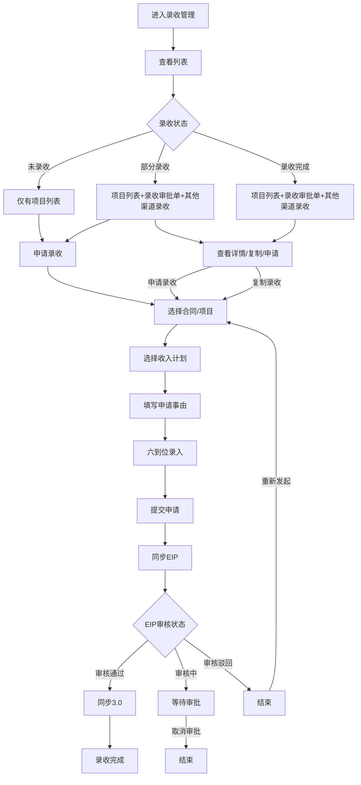
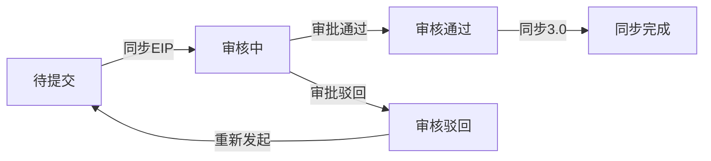

# 录收管理

## 需求背景

### 痛点
- **问题现象**：当前业务中缺乏对录收的集中管理，录收流程分散，难以追踪和统计，六到位无卡位环节。
- **发生频率**：高修改测试

### 业务目标
- **量化指标**：提供统一的录收管理入口，实现录收状态的实时追踪
- **目标期限**：尽快上线

### 涉及系统/模块
- **模块名称**：录收管理
- **变更类型**：新增
- **对接接口**：纯前端静态页面

---

## 用户故事

### 故事1
- **角色**：财务人员/业务人员
- **功能**：查询和查看各商机/合同/项目的录收状态
- **收益**：快速了解录收进度，提高工作效率
- **验收条件**：能够按商机名称、编码、合同、项目等条件筛选查看

### 故事2
- **角色**：业务人员
- **功能**：发起录收申请
- **收益**：在线完成录收申请流程，减少线下沟通
- **验收条件**：能够选择合同/项目、选择收入计划、填写申请事由

---

## 需求清单

| 序号 | 需求描述 | 优先级 | 状态 | 负责人 | 截止日期 |
|------|----------|--------|------|--------|----------|
| 1 | 左侧菜单增加录收管理入口 | P0 | DONE | | |
| 2 | 录收管理主列表页面（查询条件+外层列表+内层展开行） | P0 | DONE | | |
| 3 | 申请录收弹窗（合同选择+收入计划选择+申请事由+六到位入口） | P0 | DONE | | |
| 4 | 内层录收审批单列表展示 | P0 | DONE | | |
| 5 | 录收详情弹窗（六到位纵览+收支提醒+附件网格） | P0 | DONE | | |

---

## 业务流程图

---

## 页面结构

### 路由信息
- **路由路径** - revenue-management
- **页面标题** - 录收管理
- **访问权限** - 登录

### 布局结构
- **布局类型** - 单栏
- **区域-页面标题** - 页面标题 + 副标题
- **区域-查询条件** - 查询条件（商机/合同/项目/录收状态筛选）
- **区域-操作栏** - 结果统计 + 申请录收按钮
- **区域-外层表格** - 录收列表（含内层展开行）
- **申请弹窗** - 选择合同/项目 + 收入计划选择 + 申请事由 + 六到位附件情况
- **详情弹窗** - 六到位纵览 + 合同/项目信息 + 收支不匹配提醒 + 审批单信息 + 六到位附件详情

### 表格布局规范
- **外层表格**：整体宽度固定（左右 `px-6` 边距），内容在框内横向滚动，列 `min-w-[1200px]`，操作列 `sticky right-0` 固定在右侧
- **内层表格**：自适应父容器宽度（`w-full`），内部列 `min-w-[1400px]` 撑开滚动容器，操作列 `sticky right-0` 固定在右侧，表头 `sticky top-0` 固定在顶部，最大高度 `320px` 超出竖向滚动，背景色 `bg-gray-100` 加深与外层区分

---

## 功能描述

### 功能点1：录收管理主页面

#### 页面级
- **字段：功能入口** - 侧边栏菜单"录收管理"
- **字段：前置条件** - 登录系统
- **字段：后置影响** - 无

#### 查询条件字段
| 字段名 | 类型 | 必填 | 默认值 | 来源 | 校验规则 | 展示形式 | 交互约束 |
|--------|------|------|--------|------|----------|----------|----------|
| 商机名称 | 文本 | 否 | 空 | 用户输入 | 无 | 输入框 | 可编辑 |
| 商机编码 | 文本 | 否 | 空 | 用户输入 | 无 | 输入框 | 可编辑 |
| 合同名称 | 文本 | 否 | 空 | 用户输入 | 无 | 输入框 | 可编辑 |
| 合同编码 | 文本 | 否 | 空 | 用户输入 | 无 | 输入框 | 可编辑 |
| 项目名称 | 文本 | 否 | 空 | 用户输入 | 无 | 输入框 | 可编辑 |
| 项目编码 | 文本 | 否 | 空 | 用户输入 | 无 | 输入框 | 可编辑 |
| 录收状态 | 枚举 | 否 | 全部 | 下拉选择 | 无 | 下拉选择（全部/未录收/部分录收/录收完成） | 可编辑 |

#### 外层列表字段
| 字段名 | 类型 | 必填 | 默认值 | 来源 | 校验规则 | 展示形式 | 交互约束 |
|--------|------|------|--------|------|----------|----------|----------|
| 展开 | 操作 | 是 | 未展开 | 用户点击 | 无 | 展开箭头图标 | 可编辑 |
| 序号 | 数字 | 是 | 自动 | 系统生成 | 无 | 文本 | 只读 |
| 商机名称 | 文本 | 是 | - | 接口返回 | 无 | 文本+截断 | 只读 |
| 商机编码 | 文本 | 是 | - | 接口返回 | 无 | 文本 | 只读 |
| 合同名称 | 文本 | 是 | - | 接口返回 | 无 | 文本+截断 | 只读 |
| 合同编码 | 文本 | 是 | - | 接口返回 | 无 | 文本 | 只读 |
| 项目名称 | 文本 | 是 | - | 接口返回 | 无 | 文本+截断 | 只读 |
| 项目编码 | 文本 | 是 | - | 接口返回 | 无 | 文本 | 只读 |
| 是否录收完成 | 枚举 | 是 | - | 计算得出 | 无 | 标签（绿色录收完成/蓝色部分录收/橙色未录收） | 只读 |
| 最新录收时间 | 日期时间 | 是 | - | 接口返回 | 无 | 文本 | 只读 |
| 项目总金额 | 对象 | 是 | - | 接口返回 | 无 | 点击展开显示5个子项（产数服务/产数标品/基本面/设备销售/代收代付），右箭头在文字右侧 | 只读 |
| 确认录收金额 | 对象 | 是 | - | 接口返回 | 无 | 同上，绿色数字 | 只读 |
| 未确认录收金额 | 对象 | 是 | - | 接口返回 | 无 | 同上，橙色数字 | 只读 |
| 操作 | 操作组 | 是 | - | 接口返回 | 无 | 链接按钮，固定在右侧，展开时跟随滚动 | 可编辑 |

#### 操作列按钮规则
| 录收状态 | 展开按钮 | 展示按钮 |
|----------|----------|----------|
| 未录收 | 无 | 申请录收 |
| 部分录收 | 有 | 查看审批单 + 申请录收  |
| 录收完成 | 有 | 查看审批单 |

#### 录收状态计算规则
- **未录收**：`isCompleted === false` 且 `approvalList.length === 0`，橙色标签
- **部分录收**：`isCompleted === false` 且 `approvalList.length > 0`，蓝色标签
- **录收完成**：`isCompleted === true`，绿色标签

#### 内层列表操作按钮规则
| EIP审核状态 | 第三按钮 | 颜色 | 说明 |
|------------|----------|------|------|
| 未同步（syncEipTime为空或"-"） | 同步EIP | 蓝色 | 点击发起同步EIP流程 |
| 审核中 | 取消审批 | 红色 | 点击取消当前审批 |
| 审核驳回 | 无 | - | 仅显示复制和录收详情 |
| 审核通过 | 同步3.0 | 蓝色 | 点击发起同步3.0流程 |
| **复制** | - | 蓝色 | 始终显示，点击打开预填表单 |
| **录收详情** | - | 蓝色 | 始终显示，点击打开详情弹窗 |

#### 按钮与状态关系矩阵
| 状态 | 复制 | 录收详情 | 同步EIP | 取消审批 | 同步3.0 |
|------|------|----------|---------|----------|---------|
| 未同步 | ✓ | ✓ | ✓ | ✗ | ✗ |
| 审核中 | ✓ | ✓ | ✗ | ✓ | ✗ |
| 审核驳回 | ✓ | ✓ | ✗ | ✗ | ✗ |
| 审核通过 | ✓ | ✓ | ✗ | ✗ | ✓ |

#### EIP审核状态机

**状态说明**：
- **待提交**：录收单已创建，未同步到EIP系统，syncEipTime为空或"-"，显示"同步EIP"按钮
- **审核中**：已同步EIP，等待审批，eipStatus="审核中"，显示"取消审批"按钮
- **审核驳回**：EIP审批被驳回，eipStatus="审核驳回"，无第三按钮，可"复制"重新发起
- **审核通过**：EIP审批通过，eipStatus="审核通过"，显示"同步3.0"按钮
- **同步完成**：已同步到3.0系统，sync30Time有值，流程结束

#### 录收单复制功能
- **功能入口**：外层列表操作列"复制录收"按钮（部分录收状态可见）、内层审批单列表"复制"按钮
- **触发行为**：点击后打开"申请录收"弹窗，自动匹配并选中对应的合同/项目，预填申请事由（包含原审批单名称和EIP文号）
- **预填规则**：从审批单名称或EIP文号中匹配合同列表，找不到时默认选第一份合同；申请事由格式为"基于录收审批单【{名称}】（EIP文号：{文号}）发起录收申请"
- **关闭行为**：关闭弹窗后清空预填数据，下次打开为空白表单

#### 金额分组结构
- **总金额/产数服务/产数标品/基本面/设备销售/代收代付**
- 三个金额列均支持点击展开，每个展开显示5个子项列（背景浅蓝色）

### 功能点2：内层录收审批单列表

#### 页面级
- **字段：功能入口** - 点击外层列表行左侧展开箭头
- **字段：前置条件** - 该条记录有录收审批单
- **字段：后置影响** - 无
- **布局**：固定宽度 `1400px`，框内横向滚动，操作列 `sticky right-0` 固定右侧，表头 `sticky top-0`
- **样式**：容器背景色 `bg-gray-100`，表头 `bg-gray-200`，表格行白色，操作列 `bg-gray-100`，与外层形成视觉区分

#### 内层列表字段
| 字段名 | 类型 | 必填 | 默认值 | 来源 | 校验规则 | 展示形式 | 交互约束 |
|--------|------|------|--------|------|----------|----------|----------|
| 序号 | 数字 | 是 | 自动 | 系统生成 | 无 | 文本 | 只读 |
| 录收名称 | 文本 | 是 | - | 接口返回 | 无 | 文本+截断 | 只读 |
| 录收金额 | 货币 | 是 | - | 接口返回 | 无 | 右对齐文本 | 只读 |
| EIP文号 | 文本 | 是 | - | 接口返回 | 无 | 文本 | 只读 |
| EIP发文id | 文本 | 是 | - | 接口返回 | 无 | 文本 | 只读 |
| 拟稿部门 | 文本 | 是 | - | 接口返回 | 无 | 文本 | 只读 |
| 同步EIP时间 | 日期时间 | 是 | - | 接口返回 | 无 | 文本 | 只读 |
| EIP审核状态 | 枚举 | 是 | - | 接口返回 | 无 | 标签（绿色审核通过/黄色审核中/灰色其他） | 只读 |
| 预售理单号 | 文本 | 是 | - | 接口返回 | 无 | 文本 | 只读 |
| 订单id | 文本 | 是 | - | 接口返回 | 无 | 文本 | 只读 |
| 订单编码 | 文本 | 是 | - | 接口返回 | 无 | 文本 | 只读 |
| 同步3.0时间 | 日期时间 | 是 | - | 接口返回 | 无 | 文本 | 只读 |
| 操作 | 操作组 | 是 | - | 接口返回 | 无 | 链接按钮（复制/录收详情/同步EIP/取消审批/同步3.0，按钮根据状态显示/隐藏），固定在右侧 | 可编辑 |

#### 其他渠道录收列表字段
| 字段名 | 类型 | 必填 | 默认值 | 来源 | 校验规则 | 展示形式 | 交互约束 |
|--------|------|------|--------|------|----------|----------|----------|
| 序号 | 数字 | 是 | 自动 | 系统生成 | 无 | 文本 | 只读 |
| 合同名称 | 文本 | 是 | - | 接口返回 | 无 | 文本+截断 | 只读 |
| 合同编码 | 文本 | 是 | - | 接口返回 | 无 | 文本 | 只读 |
| 产品收入项 | 文本 | 是 | - | 接口返回 | 无 | 文本+截断 | 只读 |
| 产品收入项编码 | 文本 | 是 | - | 接口返回 | 无 | 文本 | 只读 |
| 账期 | 文本 | 是 | - | 接口返回 | 无 | 文本 | 只读 |
| 金额（不含税） | 货币 | 是 | - | 接口返回 | 无 | 右对齐，绿色字体 | 只读 |

### 功能点3：申请录收弹窗

#### 弹窗级
- **弹窗：申请录收**
  - **触发入口**：点击"申请录收"Tab + 引导页按钮 / 列表操作列"申请录收"按钮 / 列表操作列"复制录收"按钮（预填数据）
  - **关闭方式**：关闭图标/取消按钮
  - **尺寸**：固定 `95vw / 90vh`，支持全屏切换按钮
  - **字段列表**：

##### 合同/项目选择区块
| 字段名 | 类型 | 必填 | 默认值 | 来源 | 校验规则 | 展示形式 | 交互约束 |
|--------|------|------|--------|------|----------|----------|----------|
| 客户名称 | 文本 | 是 | - | 选择合同后展示 | 无 | 只读文本 | 只读 |
| 客户编码 | 文本 | 是 | - | 选择合同后展示 | 无 | 只读文本 | 只读 |
| 合同名称 | 文本 | 是 | - | 选择合同后展示 | 无 | 只读文本 | 只读 |
| 合同编码 | 文本 | 是 | - | 选择合同后展示 | 无 | 只读文本 | 只读 |
| 合同金额 | 货币 | 是 | - | 选择合同后展示 | 无 | 只读文本，蓝字加粗 | 只读 |
| 项目名称 | 文本 | 是 | - | 选择合同后展示 | 无 | 只读文本 | 只读 |
| 项目编码 | 文本 | 是 | - | 选择合同后展示 | 无 | 只读文本 | 只读 |
| 合同确认录收金额 | 货币 | 是 | - | 选择合同后展示 | 无 | 只读文本，绿色 | 只读 |
| 合同未确认录收金额 | 货币 | 是 | - | 选择合同后展示 | 无 | 只读文本，橙色 | 只读 |
| 合同累计确认收款金额 | 货币 | 是 | - | 选择合同后展示 | 无 | 只读文本 | 只读 |
| 合同剩余未收款金额 | 货币 | 是 | - | 选择合同后展示 | 无 | 只读文本，红色 | 只读 |
| 收支不匹配提醒 | 区块 | 是 | - | 计算得出 | 超10%高亮红色脉冲 | 醒目提示框（警告图标+百分比数值+描述文字） | 只读 |
| 当前项目截止当月计划列收 | 货币 | 是 | - | 选择合同后展示 | 无 | 只读文本 | 只读 |
| 当前项目截止当月已列收 | 货币 | 是 | - | 选择合同后展示 | 无 | 只读文本 | 只读 |
| 当前项目截止当月计划列账 | 货币 | 是 | - | 选择合同后展示 | 无 | 只读文本 | 只读 |
| 当前项目截止当月已列支 | 货币 | 是 | - | 选择合同后展示 | 无 | 只读文本 | 只读 |

##### 收支不匹配提醒样式
- **正常（≤10%）**：绿色背景（`bg-green-50`），绿色边框（`border-green-200`），绿色勾图标，绿色文字
- **异常（>10%）**：红色背景（`bg-red-50`），红色边框（`border-red-300`），**脉冲动画**（`animate-pulse`），橙色警告图标，红色文字，醒目显示百分比数值

##### 合同/项目选择弹窗
| 字段名 | 类型 | 必填 | 默认值 | 来源 | 校验规则 | 展示形式 | 交互约束 |
|--------|------|------|--------|------|----------|----------|----------|
| 客户名称 | 文本 | 否 | 空 | 用户输入 | 无 | 输入框 | 可编辑 |
| 客户编码 | 文本 | 否 | 空 | 用户输入 | 无 | 输入框 | 可编辑 |
| 合同名称 | 文本 | 否 | 空 | 用户输入 | 无 | 输入框 | 可编辑 |
| 合同编码 | 文本 | 否 | 空 | 用户输入 | 无 | 输入框 | 可编辑 |
| 项目名称 | 文本 | 否 | 空 | 用户输入 | 无 | 输入框 | 可编辑 |
| 项目编码 | 文本 | 否 | 空 | 用户输入 | 无 | 输入框 | 可编辑 |

##### 收入计划选择-Tab
| 字段名 | 类型 | 必填 | 默认值 | 来源 | 校验规则 | 展示形式 | 交互约束 |
|--------|------|------|--------|------|----------|----------|----------|
| 周期性收入计划 | Tab | 是 | 周期性 | 用户切换 | 无 | Tab切换，蓝字下划线 | 可编辑 |
| 非周期性收入计划 | Tab | 是 | - | 用户切换 | 无 | Tab切换 | 可编辑 |

##### 周期性收入计划列表字段
| 字段名 | 类型 | 必填 | 默认值 | 来源 | 校验规则 | 展示形式 | 交互约束 |
|--------|------|------|--------|------|----------|----------|----------|
| 勾选框 | 布尔 | 是 | 未勾选 | 用户选择 | 至少选一个 | Checkbox | 可编辑 |
| 序号 | ���字 | 是 | 自��� | 系统生成 | 无 | 文本 | 只读 |
| 产品收入项 | 文本 | 是 | - | 接口返回 | 无 | 文本+截断 | 只读 |
| 业务类型 | 枚举 | 是 | - | 接口返回 | 无 | 文本 | 只读 |
| 发票种类 | 枚举 | 是 | - | 接口返回 | 无 | 文本 | 只读 |
| 税率 | 百分比 | 是 | - | 接口返回 | 无 | 文本 | 只读 |
| 计划确认总金额(含税) | 货币 | 是 | - | 接口返回 | 无 | 右对齐文本 | 只读 |
| 计划确认总金额(不含税) | 货币 | 是 | - | 接口返回 | 无 | 右对齐文本 | 只读 |
| 预计确认日期 | 日期 | 是 | - | 接口返回 | 无 | 文本 | 只读 |
| 收入触发系统 | 文本 | 是 | - | 接口返回 | 无 | 文本 | 只读 |
| 计划状态 | 枚举 | 是 | - | 接口返回 | 无 | 标签 | 只读 |
| 摘要 | 文本 | 是 | - | 接口返回 | 无 | 文本+截断 | 只读 |
| 类型 | 文本 | 是 | 周期性 | 接口返回 | 无 | 文本 | 只读 |

##### 非周期性收入计划列表字段
| 字段名 | 类型 | 必填 | 默认值 | 来源 | 校验规则 | 展示形式 | 交互约束 |
|--------|------|------|--------|------|----------|----------|----------|
| 勾选框 | 布尔 | 是 | 未勾选 | 用户选择 | 至少选一个 | Checkbox | 可编辑 |
| 序号 | 数字 | 是 | 自动 | 系统生成 | 无 | 文本 | 只读 |
| 产品收入项 | 文本 | 是 | - | 接口返回 | 无 | 文本+截断 | 只读 |
| 业务类型 | 枚举 | 是 | - | 接口返回 | 无 | 文本 | 只读 |
| 发票种类 | 枚举 | 是 | - | 接口返回 | 无 | 文本 | 只读 |
| 税率 | 百分比 | 是 | - | 接口返回 | 无 | 文本 | 只读 |
| 单价 | 货币 | 是 | - | 接口返回 | 无 | 右对齐文本 | 只读 |
| 数量 | 数字 | 是 | - | 接口返回 | 无 | 右对齐文本 | 只读 |
| 确认金额(含税) | 货币 | 是 | - | 接口返回 | 无 | 右对齐文本 | 只读 |
| 确认金额(不含税) | 货币 | 是 | - | 接口返回 | 无 | 右对齐文本 | 只读 |
| 频率(月) | 数字 | 是 | - | 接口返回 | 无 | 居中文本 | 只读 |
| 确认总金额(含税) | 货币 | 是 | - | 接口返回 | 无 | 右对齐文本 | 只读 |
| 确认总金额(不含税) | 货币 | 是 | - | 接口返回 | 无 | 右对齐文本 | 只读 |
| 起始日期 | 日期 | 是 | - | 接口返回 | 无 | 文本 | 只读 |
| 终止日期 | 日期 | 是 | - | 接口返回 | 无 | 文本 | 只读 |
| 收入触发系统 | 文本 | 是 | - | 接口返回 | 无 | 文本 | 只读 |
| 计划状态 | 枚举 | 是 | - | 接口返回 | 无 | 标签 | 只读 |
| 摘要 | 文本 | 是 | - | 接口返回 | 无 | 文本+截断 | 只读 |
| 类型 | 文本 | 是 | 非周期性 | 接口返回 | 无 | 文本 | 只读 |

##### 申请事由和附件区块
| 字段名 | 类型 | 必填 | 默认值 | 来源 | 校验规则 | 展示形式 | 交互约束 |
|--------|------|------|--------|------|----------|----------|----------|
| 申请事由 | 多行文本 | 是 | 空 | 用户输入 | 非空 | textarea，高度96px | 可编辑 |
| 六到位附件情况 | 区块组 | 否 | - | 接口返回+Mock | 无 | 6个到位卡片列表，每个含录入按钮和附件清单 | 可编辑 |
| 形象进度表 | 文件 | 否 | - | 用户上传 | 无 | 拖拽上传区域 | 可编辑 |

##### 六到位附件情况样式
- 6个到位以卡片列表展示（垂直排列）
- 每个到位卡片：到位名称（蓝色圆点前缀）+ 附件数量 + 录入按钮（点击打开六到位录入弹窗）
- 附件清单：缩进显示文件名 + 文件大小
- 6个到位：客情掌握、方案总控、谈判/应标自主、采购自主、项目强管控、运维自主

##### 六到位录入弹窗
| 字段名 | 类型 | 必填 | 默认值 | 来源 | 校验规则 | 展示形式 | 交互约束 |
|--------|------|------|--------|------|----------|----------|----------|
| 已上传附件列表 | 文件列表 | 否 | - | 接口返回 | 无 | 表格（文件名/大小/上传时间/操作） | 可编辑 |
| 上传新附件 | 文件 | 否 | - | 用户上传 | 无 | 拖拽上传区域 | 可编辑 |

  - **确定按钮**：点击后提交申请
  - **取消按钮**：点击后关闭弹窗，不调用接口，不修改数据

### 功能点4：录收详情弹窗（新增）

#### 弹窗级
- **弹窗：录收详情**
  - **触发入口**：点击内层录收审批单列表操作栏"录收详情"按钮
  - **关闭方式**：关闭图标/取消按钮
  - **尺寸**：固定 `95vw / 90vh`，支持全屏切换按钮

##### 六到位纵览区块
| 字段名 | 类型 | 必填 | 默认值 | 来源 | 校验规则 | 展示形式 | 交互约束 |
|--------|------|------|--------|------|----------|----------|----------|
| 六到位纵览 | 区块组 | 是 | - | 接口返回+Mock | 无 | 顶部独立区域，6个小卡片横排，显示点亮状态和附件数量 | 只读 |
| 六到位-客情掌握 | 状态 | 是 | - | 接口返回 | 无 | 绿色（已点亮）/灰色（未点亮）小卡片，含圆点、名称、状态文字、附件数量 | 只读 |
| 六到位-方案总控 | 状态 | 是 | - | 接口返回 | 无 | 同上 | 只读 |
| 六到位-谈判/应标自主 | 状态 | 是 | - | 接口返回 | 无 | 同上 | 只读 |
| 六到位-采购自主 | 状态 | 是 | - | 接口返回 | 无 | 同上 | 只读 |
| 六到位-项目强管控 | 状态 | 是 | - | 接口返回 | 无 | 同上 | 只读 |
| 六到位-运维自主 | 状态 | 是 | - | 接口返回 | 无 | 同上 | 只读 |
| 点亮汇总徽章 | 文本 | 是 | - | 计算得出 | 无 | "4/6 已点亮"徽章，绿色/黄色/灰色背景 | 只读 |

##### 纵览小卡片样式
- 6列网格布局（`grid-cols-6`），每列一个小卡片
- **已点亮**：绿色背景（`bg-green-50`），绿色边框（`border-green-200`），绿色圆点，绿色文字
- **未点亮**：灰色背景（`bg-gray-50`），灰色边框（`border-gray-200`），灰色圆点，灰色文字
- 内容：圆点 + 到位名称 + 状态文字（已点亮/未点亮）+ 附件数量

##### 合同/项目信息区块
| 字段名 | 类型 | 必填 | 默认值 | 来源 | 校验规则 | 展示形式 | 交互约束 |
|--------|------|------|--------|------|----------|----------|----------|
| 商机名称 | 文本 | 是 | - | 接口返回 | 无 | 只读文本 | 只读 |
| 商机编码 | 文本 | 是 | - | 接口返回 | 无 | 只读文本 | 只读 |
| 合同名称 | 文本 | 是 | - | 接口返回 | 无 | 只读文本 | 只读 |
| 合同编码 | 文本 | 是 | - | 接口返回 | 无 | 只读文本 | 只读 |
| 项目名称 | 文本 | 是 | - | 接口返回 | 无 | 只读文本 | 只读 |
| 项目编码 | 文本 | 是 | - | 接口返回 | 无 | 只读文本 | 只读 |
| 合同金额 | 货币 | 是 | - | 接口返回 | 无 | 只读文本，蓝字加粗 | 只读 |
| 合同确认录收金额 | 货币 | 是 | - | 接口返回 | 无 | 只读文本，绿色 | 只读 |
| 合同未确认录收金额 | 货币 | 是 | - | 接口返回 | 无 | 只读文本，橙色 | 只读 |
| 合同累计确认收款金额 | 货币 | 是 | - | 接口返回 | 无 | 只读文本 | 只读 |
| 合同剩余未收款金额 | 货币 | 是 | - | 接口返回 | 无 | 只读文本，红色 | 只读 |
| 是否录收完成 | 布尔 | 是 | - | 接口返回 | 无 | 绿色（录收完成）/橙色（未录收） | 只读 |
| 收支不匹配提醒 | 区块 | 是 | - | 计算得出 | 默认高亮 | 默认红色脉冲提示（超10%），显示计划列收/已列收/计划列账/已列支金额和差异百分比 | 只读 |
| 申请时间 | 日期时间 | 是 | - | 接口返回 | 无 | 只读文本 | 只读 |
| EIP状态 | 枚举 | 是 | - | 接口返回 | 无 | 标签（绿色审核通过/黄色审核中） | 只读 |

##### 收支不匹配提醒样式（详情弹窗默认高亮）
- 默认显示数据：计划列收 50,000.00 元，已列收 42,000.00 元（差异 16%），超10%触发高亮
- **异常（>10%）**：红色背景（`bg-red-50`），红色边框（`border-red-300`），**脉冲动画**（`animate-pulse`），警告图标，红色大号百分比数值

##### 录收审批单信息区块
| 字段名 | 类型 | 必填 | 默认值 | 来源 | 校验规则 | 展示形式 | 交互约束 |
|--------|------|------|--------|------|----------|----------|----------|
| 录收名称 | 文本 | 是 | - | 接口返回 | 无 | 只读文本 | 只读 |
| 录收金额 | 货币 | 是 | - | 接口返回 | 无 | 只读文本，绿色加粗 | 只读 |
| EIP文号 | 文本 | 是 | - | 接口返回 | 无 | 只读文本 | 只读 |
| EIP发文id | 文本 | 是 | - | 接口返回 | 无 | 只读文本 | 只读 |
| 拟稿部门 | 文本 | 是 | - | 接口返回 | 无 | 只读文本 | 只读 |
| 同步EIP时间 | 日期时间 | 是 | - | 接口返回 | 无 | 只读文本 | 只读 |
| EIP审核状态 | 枚举 | 是 | - | 接口返回 | 无 | 标签 | 只读 |
| 预售理单号 | 文本 | 是 | - | 接口返回 | 无 | 只读文本 | 只读 |
| 订单id | 文本 | 是 | - | 接口返回 | 无 | 只读文本 | 只读 |
| 订单编码 | 文本 | 是 | - | 接口返回 | 无 | 只读文本 | 只读 |
| 同步3.0时间 | 日期时间 | 是 | - | 接口返回 | 无 | 只读文本 | 只读 |

##### 六到位附件详情区块（响应式网格）
| 字段名 | 类型 | 必填 | 默认值 | 来源 | 校验规则 | 展示形式 | 交互约束 |
|--------|------|------|--------|------|----------|----------|----------|
| 六到位附件详情 | 区块组 | 是 | - | 接口返回+Mock | 无 | 响应式网格（1列/2列/3列自适应） | 只读 |
| 六到位-{到位名称} | 区块 | 是 | - | 接口返回 | 无 | 卡片：圆点+名称+状态徽章+附件数量 | 只读 |
| 附件项 | 文件 | 是 | - | 接口返回 | 无 | 文件图标+文件名+大小+上传时间，白色背景带边框行 | 只读 |
| 形象进度表 | 文件 | 是 | - | 接口返回 | 无 | 文件图标+文件名+大小+上传时间 | 只读 |

##### 附件网格响应式规则
- **默认**：一行3列（`lg:grid-cols-3`）
- **窄屏**（sm）：一行2列（`sm:grid-cols-2`）
- **更窄屏**：一行1列（`grid-cols-1`）

##### 底部按钮
| 按钮名 | 类型 | 触发行为 |
|--------|------|----------|
| 撤回 | 按钮 | 调用撤回接口（Mock） |
| 编辑 | 按钮 | 打开编辑模式（Mock） |
| 关闭 | 按钮 | 关闭弹窗 |

---

## 数据流图

### 数据1：录收管理列表
- **数据内容** - 静态Mock数据
- **存储位置** - 前端内存

### 数据2：录收审批单列表
- **数据内容** - 静态Mock数据（内嵌于外层列表数据中）
- **存储位置** - 前端内存

### 数据3：六到位附件数据
- **数据内容** - 静态Mock数据
- **存储位置** - 前端内存

### 数据刷新点
- **刷新时机** - 页面加载
- **影响字段** - 全量刷新

---

## 验收标准

### 正常流程
- [ ] **操作**：点击左侧菜单"录收管理" → **预期**：页面加载，显示录收管理列表
- [ ] **操作**：点击顶部"申请录收"按钮 → **预期**：申请录收弹窗打开
- [ ] **操作**：在查询录收视图的"录收状态"筛选 → **预期**：支持全部/未录收/部分录收/录收完成四种筛选
- [ ] **操作**：查看列表状态标签 → **预期**：橙色=未录收，蓝色=部分录收，绿色=录收完成
- [ ] **操作**：横向滚动外层表格 → **预期**：操作列始终固定在右侧
- [ ] **操作**：点击部分录收行的"查看审批单" → **预期**：内层展开，显示录收审批单列表+其他渠道录收列表
- [ ] **操作**：查看内层展开内容 → **预期**：上方为录收审批单列表，下方为其他渠道录收列表
- [ ] **操作**：横向滚动内层表格 → **预期**：内层表格在固定 1400px 宽度内滚动，操作列固定右侧
- [ ] **操作**：查看内层审批单EIP状态为"未同步" → **预期**：显示复制+录收详情+同步EIP按钮
- [ ] **操作**：查看内层审批单EIP状态为"审核中" → **预期**：显示复制+录收详情+取消审批按钮（红色）
- [ ] **操作**：查看内层审批单EIP状态为"审核驳回" → **预期**：仅显示复制+录收详情（无第三按钮）
- [ ] **操作**：查看内层审批单EIP状态为"审核通过" → **预期**：显示复制+录收详情+同步3.0按钮
- [ ] **操作**：点击内层列表"复制" → **预期**：申请录收弹窗打开，表单自动选中对应合同/项目，申请事由预填原审批单名称和EIP文号
- [ ] **操作**：点击内层列表"录收详情" → **预期**：录收详情弹窗打开，显示六到位纵览和收支提醒
- [ ] **操作**：查看录收详情弹窗 → **预期**：收支不匹配默认高亮（红色脉冲），六到位纵览显示在顶部
- [ ] **操作**：调整弹窗宽度 → **预期**：六到位附件详情从3列→2列→1列自适应响应
- [ ] **操作**：在弹窗中点击"选择合同/项目" → **预期**：合同选择弹窗打开
- [ ] **操作**：选择合同后切换"周期性/非周期性"Tab → **预期**：收入计划列表切换显示
- [ ] **操作**：勾选收入计划，填写申请事由 → **预期**：提交按钮可用
- [ ] **操作**：点击"提交申请" → **预期**：显示提交成功提示，弹窗关闭

### 异常流程
- [ ] **操作**：不选择合同直接点击提交 → **预期**：提交按钮禁用
- [ ] **操作**：不勾选任何收入计划 → **预期**：提交按钮禁用
- [ ] **操作**：不填写申请事由 → **预期**：提交按钮禁用

---

## 更新记录

### v5 - 2026-05-12
- **页面结构完善**：恢复列表顶部"申请录收"按钮
- **内层列表重构**：
  - 新增"其他渠道录收列表"（序号/合同名称/合同编码/产品收入项/产品收入项编码/账期/金额不含税）
  - 录收审批单列表和其他渠道录收列表并列展示
- **内层列表按钮规则重构**：根据EIP审核状态显示不同按钮
  - 未同步EIP（syncEipTime为空或"-"）：显示"同步EIP"+复制+录收详情
  - 审核中：显示"取消审批"（红色）+复制+录收详情
  - 审核驳回：仅显示复制+录收详情（无第三按钮）
  - 审核通过：显示"同步3.0"+复制+录收详情
- **PRD补充**：
  - 状态机说明（待提交→审核中→审核通过/审核驳回→同步3.0）
  - 按钮与状态关系矩阵
  - 其他渠道录收列表字段说明
  - 业务流程图更新（审核驳回路径）

### v4 - 2026-05-12
- **页面重构**：顶部新增主路径 Tab 切换（查询录收 / 申请录收），两条独立路径
- **录收状态细分**：状态标签由两种扩展为三种——未录收（橙色）、部分录收（蓝色）、录收完成（绿色），状态由 `isCompleted + approvalList.length` 计算得出
- **操作列按钮规则重构**：
  - 未录收：无展开箭头，仅"申请录收"按钮
  - 部分录收：有展开箭头，"查看审批单"+"申请录收"+"复制录收"按钮
  - 录收完成：有展开箭头，仅"查看审批单"按钮
- **筛选条件更新**：录收状态下拉新增"部分录收"选项

### v3 - 2026-05-12
- **业务流程图更新**：体现完整录收流程——发起申请 → 同步EIP → 审核通过同步3.0 → 审核不通过重新发起
- **录收单复制功能（新增）**：内层审批单列表增加"复制"按钮，点击打开申请录收弹窗并预填合同/项目数据和申请事由
- **内层表格样式加深**：容器背景 `bg-gray-100`、表头 `bg-gray-200`，与外层白色背景形成视觉区分
- **Bug修复**：申请录收弹窗选择合同后白屏问题（残留未定义的子视图代码块导致JSX解析错误）

### v2 - 2026-05-12
- **布局优化**：外层表格操作列固定右侧（sticky），框内横向滚动
- **新增字段**：外层列表新增"最新录收时间"字段
- **内层表格优化**：自适应父容器宽度，内部 min-w-[1400px] 撑开滚动容器，操作列固定右侧，表头固定顶部
- **内层按钮显示逻辑**：
  - 录收详情：始终显示
  - 同步EIP：仅在未同步时显示（syncEipTime 为空或 "-"）
  - 同步3.0：仅在EIP审核通过且未同步3.0时显示
- **录收详情弹窗（新增）**：
  - 顶部六到位纵览：6个小卡片横排，显示已点亮/未点亮状态和附件数量，顶部汇总徽章
  - 收支不匹配默认高亮（红色脉冲动画），默认显示不匹配数据
  - 六到位附件详情：响应式网格（1/2/3列自适应）
  - 录收审批单信息区块：展示当前审批单完整字段
- **六到位附件情况**：改为附件列表展示，点击录入打开六到位录入弹窗，每个到位含多个附件

### v1 - 2026-05-12
- 初始版本：完成录收管理模块开发
  - 侧边栏菜单入口
  - 主列表页面（查询条件+外层列表+内层展开行）
  - 申请录收弹窗
  - 内层录收审批单列表
