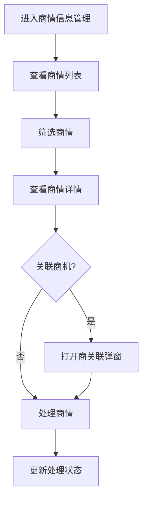

# 商情信息管理 PRD

## 需求背景
管理系统商情信息，支持多维度筛选和关联，是商机线索的重要来源。

## 前端页面描述
- 组件：BusinessInfoManagement / BusinessInfoDetailModal
- 位置：作为页面内容显示

## 功能描述

### 页面布局
| 区域 | 组件 | 说明 |
|------|------|------|
| 两级过滤标签 | 按钮组 | 全部/未处理/已处理/我关注的 |
| 操作区 | 按钮组 | 新增、导出、筛选 |
| 数据表格 | 30列超宽表 | 展示商情完整信息 |
| 详情弹窗 | BusinessInfoDetailModal | 查看商情详情 |
| 商关联弹窗 | LinkOpportunityDialog | 将商情与商机关联 |

### 查询字段
| 字段名 | 类型 | 必填 | 默认值 | 说明 |
|--------|------|------|--------|------|
| 关键词 | Input | 否 | 空 | 搜索公司名/商情标题 |
| 处理状态 | Select | 否 | 全部 | 未处理/已处理/我关注 |
| 时间范围 | DateRangePicker | 否 | 空 | - |

### 表格列（30列）
| 列名 | 宽度 | 可排序 | 对齐 | 说明 |
|------|------|--------|------|------|
| 序号 | 60px | 否 | center | - |
| 商情编号 | 120px | 否 | center | - |
| 客户名称 | 160px | 否 | left | - |
| 商机名称 | 200px | 否 | left | - |
| 省份 | 80px | 否 | center | - |
| 行业 | 100px | 否 | center | - |
| 客户等级 | 80px | 否 | center | Badge |
| 商机金额 | 120px | 是 | right | 万元 |
| 商机等级 | 80px | 否 | center | Badge |
| 负责人 | 100px | 否 | center | - |
| 跟进次数 | 80px | 否 | center | - |
| 处理状态 | 100px | 否 | center | Badge |
| 创建时间 | 120px | 否 | center | - |
| 操作 | 120px | 否 | center | 查看详情/关联商机 |

### 处理状态Badge
| 状态值 | 颜色 | 说明 |
|--------|------|------|
| 未处理 | 灰色 | 商情待处理 |
| 已处理 | 绿色 | 商情已处理 |
| 我关注 | 蓝色 | 我关注的商情 |

### 客户等级Badge
| 等级 | 颜色 | 说明 |
|------|------|------|
| A | 红色 | 重点客户 |
| B | 橙色 | 主要客户 |
| C | 蓝色 | 一般客户 |

### 操作按钮
| 按钮名称 | 位置 | 样式 | 说明 |
|----------|------|------|------|
| 新增商情 | 操作区 | Primary | 打开新增商情弹窗 |
| 导出数据 | 操作区 | Outline | 批量导出商情数据 |
| 筛选 | 操作区 | Outline | 展开/收起筛选条件 |
| 查看详情 | 表格操作列 | text | 打开详情弹窗 |
| 关联商机 | 表格操作列 | text | 打开商关联弹窗 |

### 联动逻辑
1. 两级过滤标签联动筛选结果
2. 点击行可展开详情
3. 处理状态变更后刷新列表

## 业务流程图

## 需求清单
| 序号 | 需求描述 | 优先级 | 状态 |
|------|----------|--------|------|
| 1 | 两级过滤标签 | P0 | TODO |
| 2 | 30列超宽表格展示 | P0 | TODO |
| 3 | 详情弹窗 | P0 | TODO |
| 4 | 商关联弹窗 | P1 | TODO |
| 5 | 批量操作 | P1 | TODO |

## 验收标准
- [ ] 两级过滤标签正确筛选
- [ ] 30列正确展示
- [ ] 详情弹窗正常
- [ ] 商关联功能正常

## 更新记录
### v1 - 2026/05/08
- 初始版本（字段级别细化）
