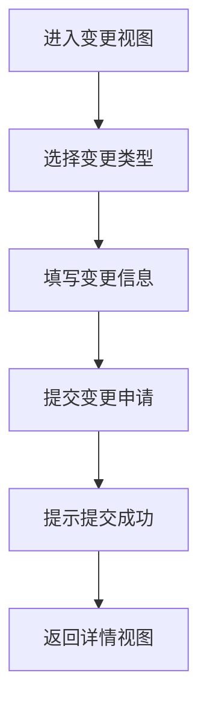

# 合同解构变更 PRD

## 需求背景
对已生效的合同解构发起变更申请，记录变更原因和内容。

## 前端页面描述
- 组件：ContractDemolitionChange
- 位置：作为子视图显示
- 交互逻辑：
  1. 选择变更类型
  2. 填写变更原因
  3. 提交变更申请

## 功能描述

### 表单字段
| 字段名 | 类型 | 必填 | 默认值 | 说明 |
|--------|------|------|--------|------|
| 变更类型 | Select | 是 | 空 | 金额变更/内容变更/终止 |
| 变更原因 | Textarea | 是 | 空 | - |
| 变更内容 | Textarea | 是 | 空 | - |

### 操作按钮
| 按钮名称 | 位置 | 样式 | 说明 |
|----------|------|------|------|
| 返回 | 顶部 | Outline | 返回详情视图 |
| 提交 | 顶部 | Primary | 提交变更申请 |

## 业务流程图

## 需求清单
| 序号 | 需求描述 | 优先级 | 状态 |
|------|----------|--------|------|
| 1 | 变更表单展示 | P0 | TODO |
| 2 | 变更提交 | P0 | TODO |

## 验收标准
- [ ] 变更表单正确展示
- [ ] 提交功能正常
- [ ] 提示信息正确

## 更新记录
### v1 - 2026/05/08
- 初始版本（字段级别细化）
