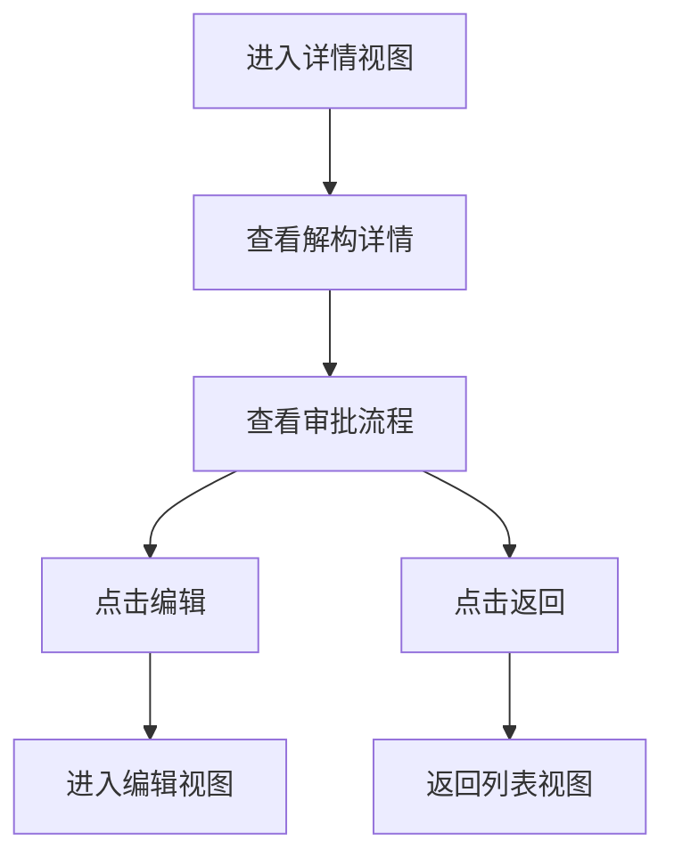

# 合同解构详情 PRD

## 需求背景
展示合同解构的完整详情信息，用于查看解构内容、审批流程和变更历史。

## 前端页面描述
- 组件：ContractDemolitionDetail
- 位置：作为子视图显示（替换列表视图区域）
- 交互逻辑：
  1. 展示解构详情信息
  2. 支持编辑和返回操作
  3. 展示审批流程

## 功能描述

### 页面布局
| 区域 | 组件 | 说明 |
|------|------|------|
| 顶部操作 | 按钮组 | 返回/编辑 |
| 详情内容区 | 滚动容器 | 展示解构详情 |
| 审批流程区 | 流程组件 | 展示审批进度 |

### 详情内容
| 区块名称 | 说明 |
|----------|------|
| 项目基本信息 | 项目编号、名称等 |
| 合同基本信息 | 合同编号、名称、金额等 |
| 解构详情 | 解构的具体内容 |
| 审批流程 | 审批进度展示 |

### 操作按钮
| 按钮名称 | 位置 | 样式 | 说明 |
|----------|------|------|------|
| 返回 | 顶部 | Outline | 返回列表视图 |
| 编辑 | 顶部 | Primary | 进入编辑视图 |

## 业务流程图

## 需求清单
| 序号 | 需求描述 | 优先级 | 状态 |
|------|----------|--------|------|
| 1 | 详情展示 | P0 | TODO |
| 2 | 审批流程展示 | P0 | TODO |
| 3 | 编辑入口 | P1 | TODO |

## 验收标准
- [ ] 详情信息正确展示
- [ ] 审批流程正确展示
- [ ] 返回和编辑按钮正常

## 更新记录
### v1 - 2026/05/08
- 初始版本（字段级别细化）
