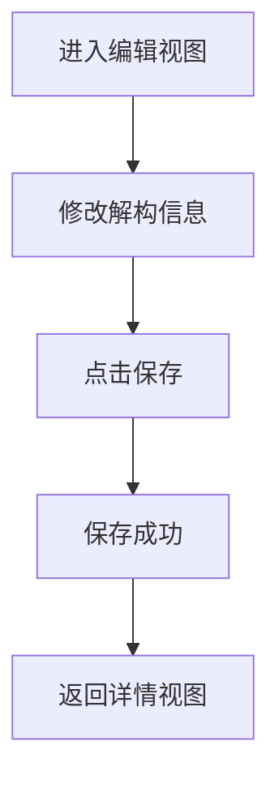

# 编辑合同解构 PRD

## 需求背景
编辑合同解构信息，修改解构内容后提交审批。

## 前端页面描述
- 组件：ContractDemolitionEdit
- 位置：作为子视图显示（替换列表视图区域）
- 交互逻辑：
  1. 展示可编辑的解构信息
  2. 支持保存和返回操作

## 功能描述

### 表单字段
| 字段名 | 类型 | 必填 | 默认值 | 说明 |
|--------|------|------|--------|------|
| 项目编号 | text | - | 当前值 | 只读 |
| 项目名称 | text | - | 当前值 | 只读 |
| 合同编号 | text | - | 当前值 | 只读 |
| 合同名称 | Input | 是 | 当前值 | 可编辑 |
| 合同金额 | Input | 是 | 当前值 | 可编辑 |
| 解构内容 | Textarea | 是 | 当前值 | 可编辑 |

### 操作按钮
| 按钮名称 | 位置 | 样式 | 说明 |
|----------|------|------|------|
| 返回 | 顶部 | Outline | 返回详情视图 |
| 保存 | 顶部 | Primary | 保存修改并返回 |

## 业务流程图

## 需求清单
| 序号 | 需求描述 | 优先级 | 状态 |
|------|----------|--------|------|
| 1 | 表单展示 | P0 | TODO |
| 2 | 表单编辑 | P0 | TODO |
| 3 | 保存功能 | P0 | TODO |

## 验收标准
- [ ] 表单正确展示
- [ ] 可编辑字段正常修改
- [ ] 保存功能正常

## 更新记录
### v1 - 2026/05/08
- 初始版本（字段级别细化）
