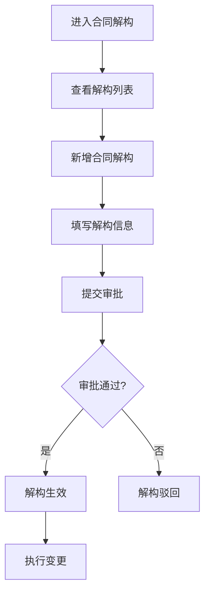

# 合同解构 PRD

## 需求背景
管理合同解构流程，包含解构列表、解构变更、解构详情和编辑功能。

## 前端页面描述
- 组件：ContractDemolition / ContractDemolitionDetail / ContractDemolitionEdit / ContractDemolitionChange
- 位置：作为页面内容显示

## 功能描述

### 页面布局
| 区域 | 组件 | 说明 |
|------|------|------|
| Tab切换 | 按钮组 | 解构列表/变更记录 |
| 统计卡片 | 卡片组 | 6个统计指标 |
| 操作区 | 按钮组 | 新增、导出、刷新 |
| 查询表单 | 表单 | 多维度筛选 |
| 数据表格 | 表格 | 解构列表 |

### Tab结构
| Tab名称 | 功能 |
|---------|------|
| 解构列表 | 展示合同解构列表 |
| 变更记录 | 展示合同解构变更记录 |

### 统计卡片
| 指标 | 说明 |
|------|------|
| 待解构 | 待解构合同数 |
| 审批中 | 审批中的合同数 |
| 已生效 | 已生效合同数 |
| 已驳回 | 已驳回合同数 |
| 变更中 | 变更中的合同数 |
| 已作废 | 已作废合同数 |

### 查询字段
| 字段名 | 类型 | 必填 | 默认值 | 说明 |
|--------|------|------|--------|------|
| 项目名称 | Input | 否 | 空 | - |
| 合同编号 | Input | 否 | 空 | - |
| 解构状态 | Select | 否 | 全部 | 待解构/审批中/已生效/已驳回/变更中/已作废 |
| 省份 | Select | 否 | 全部 | - |
| 时间范围 | DateRangePicker | 否 | 空 | - |

### 表格列
| 列名 | 宽度 | 可排序 | 对齐 | 说明 |
|------|------|--------|------|------|
| 序号 | 60px | 否 | center | - |
| 解构编号 | 120px | 否 | center | - |
| 项目编号 | 120px | 否 | center | - |
| 项目名称 | 200px | 否 | left | - |
| 合同编号 | 120px | 否 | center | - |
| 合同金额 | 120px | 是 | right | 万元 |
| 解构状态 | 100px | 否 | center | Badge |
| 审批进度 | 100px | 否 | center | - |
| 创建人 | 100px | 否 | center | - |
| 创建时间 | 120px | 否 | center | - |
| 操作 | 120px | 否 | center | 详情/编辑/变更 |

### 解构状态Badge
| 状态值 | 颜色 | 说明 |
|--------|------|------|
| 待解构 | 灰色 | 待执行解构 |
| 审批中 | 蓝色 | 解构审批中 |
| 已生效 | 绿色 | 解构已生效 |
| 已驳回 | 红色 | 解构已驳回 |
| 变更中 | 橙色 | 解构变更中 |
| 已作废 | 灰色 | 解构已作废 |

### 操作按钮
| 按钮名称 | 位置 | 样式 | 说明 |
|----------|------|------|------|
| 新增解构 | 操作区 | Primary | 打开新增解构弹窗 |
| 导出数据 | 操作区 | Outline | 导出解构数据 |
| 刷新 | 操作区 | Outline | 刷新列表 |
| 详情 | 表格操作列 | text | 打开详情弹窗 |
| 编辑 | 表格操作列 | text | 打开编辑弹窗 |
| 变更 | 表格操作列 | text | 打开变更弹窗 |

## 业务流程图

## 需求清单
| 序号 | 需求描述 | 优先级 | 状态 |
|------|----------|--------|------|
| 1 | 解构列表展示 | P0 | TODO |
| 2 | 新增解构 | P0 | TODO |
| 3 | 解构详情 | P0 | TODO |
| 4 | 解构编辑 | P0 | TODO |
| 5 | 解构变更 | P1 | TODO |
| 6 | 变更记录 | P1 | TODO |

## 验收标准
- [ ] 解构列表正确展示
- [ ] 统计卡片数据准确
- [ ] 新增/编辑功能正常
- [ ] 详情弹窗正常
- [ ] 变更功能正常

## 更新记录
### v1 - 2026/05/08
- 初始版本（字段级别细化）
