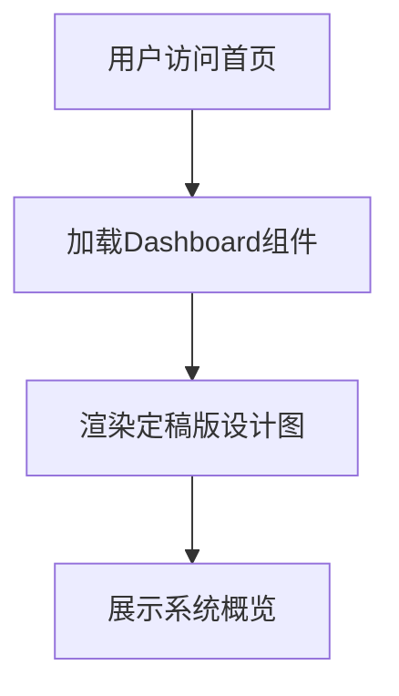

# Dashboard（仪表盘） PRD

## 需求背景
系统首页，用于展示系统整体概览和核心业务数据，帮助用户快速了解项目整体状态和关键指标。

## 前端页面描述
- 路由：`/`（默认首页）
- 页面结构：全屏仪表盘布局，渲染定稿版设计图作为主视图（1920x1080）
- 交互逻辑：用户进入系统即默认展示此页面，作为系统入口；设计图内各区域支持点击跳转至对应功能模块
- 状态说明：无状态，纯展示型页面

## 功能描述

### 页面布局
| 区域 | 组件 | 说明 |
|------|------|------|
| 主区域 | FigmaDashboard | 定稿版设计图组件，固定尺寸1920x1080，水平居中 |
| 背景 | bg-[#e7f3ff] | 浅蓝色背景 |

### 引用组件
| 组件名 | 路径 | 用途 |
|--------|------|------|
| FigmaDashboard | src/app/imports/定稿版-1/定稿版.tsx | 渲染完整设计图 |

## 业务流程图

## 需求清单
| 序号 | 需求描述 | 优先级 | 状态 |
|------|----------|--------|------|
| 1 | 渲染定稿版设计图 | P0 | DONE |
| 2 | 设计图内各区域可点击跳转 | P1 | TODO |
| 3 | 响应式适配 | P2 | TODO |

## 验收标准
- [ ] 首页正常加载显示设计图内容
- [ ] 页面无报错信息
- [ ] 设计图尺寸正确（1920x1080）
- [ ] 背景色正确显示

## 更新记录
### v1 - 2026/05/08
- 初始版本（字段级别细化）
