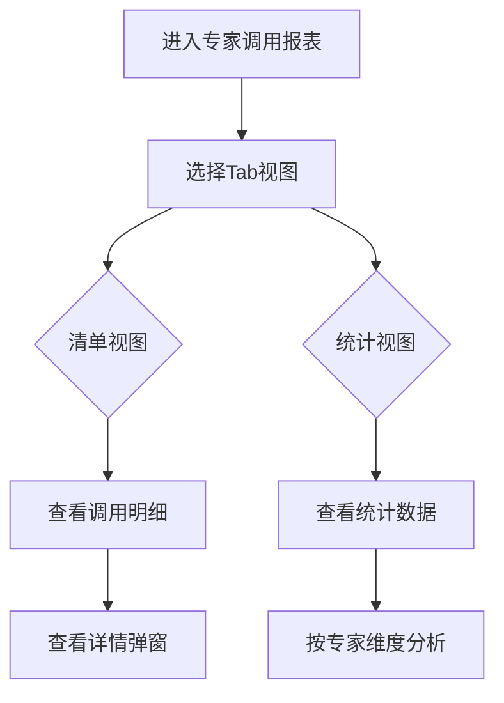

# 专家调用报表 PRD

## 需求背景
展示专家调用清单和专家调用统计，支持多维度筛选和查询，帮助管理者了解专家资源的使用情况。

## 前端页面描述
- 组件：ExpertReportPage
- 位置：作为页面内容显示

## 功能描述

### 页面布局
| 区域 | 组件 | 说明 |
|------|------|------|
| Tab切换 | 按钮组 | 专家调用清单/专家调用统计 |
| 操作区 | 按钮组 | 查询、导出、刷新 |
| 查询表单 | 表单 | 多条件筛选 |
| 数据表格 | 表格 | 展示调用数据 |

### Tab结构
| Tab名称 | 功能 |
|---------|------|
| 专家调用清单 | 展示专家调用明细列表（16列） |
| 专家调用统计 | 汇总统计专家调用数据（8列） |

### 查询字段
| 字段名 | 类型 | 必填 | 默认值 | 说明 |
|--------|------|------|--------|------|
| 派单时间 | DateRangePicker | 否 | 最近30天 | - |
| 接单状态 | Select | 否 | 全部 | 待接单/已接单/已完成/已取消 |
| 专家姓名 | Input | 否 | 空 | - |
| 项目名称 | Input | 否 | 空 | - |
| 派单人 | Input | 否 | 空 | - |

### 表格列（专家调用清单 Tab - 16列）
| 列名 | 宽度 | 可排序 | 对齐 | 说明 |
|------|------|--------|------|------|
| 序号 | 60px | 否 | center | - |
| 调用编号 | 120px | 否 | center | - |
| 专家姓名 | 100px | 否 | center | - |
| 专家类型 | 100px | 否 | center | Badge |
| 项目名称 | 200px | 否 | left | - |
| 派单时间 | 120px | 否 | center | - |
| 接单时间 | 120px | 否 | center | - |
| 完成时间 | 120px | 否 | center | - |
| 接单状态 | 100px | 否 | center | Badge |
| 派单人 | 100px | 否 | center | - |
| 服务时长 | 80px | 否 | center | 小时 |
| 评价等级 | 80px | 否 | center | Badge |
| 操作 | 100px | 否 | center | 查看详情 |

### 表格列（专家调用统计 Tab - 8列）
| 列名 | 宽度 | 可排序 | 对齐 | 说明 |
|------|------|--------|------|------|
| 序号 | 60px | 否 | center | - |
| 专家姓名 | 100px | 否 | center | - |
| 调用次数 | 100px | 是 | center | - |
| 总服务时长 | 120px | 是 | center | 小时 |
| 平均时长 | 100px | 是 | center | 小时 |
| 好评率 | 100px | 是 | center | 百分比 |
| 完成率 | 100px | 是 | center | 百分比 |
| 操作 | 100px | 否 | center | 查看详情 |

### 接单状态Badge
| 状态值 | 颜色 | 说明 |
|--------|------|------|
| 待接单 | 灰色 | 等待专家接单 |
| 已接单 | 蓝色 | 专家已接单 |
| 已完成 | 绿色 | 调用已完成 |
| 已取消 | 红色 | 调用已取消 |

### 操作按钮
| 按钮名称 | 位置 | 样式 | 说明 |
|----------|------|------|------|
| 查询 | 操作区 | Primary | 执行筛选查询 |
| 重置 | 操作区 | Outline | 重置筛选条件 |
| 导出数据 | 操作区 | Outline | 导出调用数据 |
| 刷新 | 操作区 | Outline | 刷新列表 |
| 查看详情 | 表格操作列 | text | 查看调用详情 |

### 联动逻辑
1. Tab切换时，表格列配置相应变化
2. 派单时间筛选联动接单状态筛选
3. 接单状态变更时刷新统计数据

## 业务流程图

## 需求清单
| 序号 | 需求描述 | 优先级 | 状态 |
|------|----------|--------|------|
| 1 | Tab切换功能 | P0 | TODO |
| 2 | 专家调用清单展示 | P0 | TODO |
| 3 | 专家调用统计 | P0 | TODO |
| 4 | 多条件筛选 | P1 | TODO |
| 5 | 详情弹窗 | P1 | TODO |

## 验收标准
- [ ] Tab切换正常
- [ ] 清单列表正确展示
- [ ] 统计数据准确
- [ ] 筛选条件生效

## 更新记录
### v1 - 2026/05/08
- 初始版本（字段级别细化）
