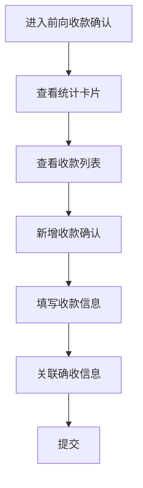

# 前向收款确认 PRD

## 需求背景
展示前向收款确认的详情和数据列表，支持关联确收信息操作。

## 前端页面描述
- 组件：ForwardReceiptConfirmation
- 位置：作为页面内容显示
- 交互逻辑：
  1. 展示收款汇总统计
  2. 展示收款确认列表
  3. 支持新增、关联、删除操作

## 功能描述

### 统计卡片
| 卡片名称 | 数值类型 | 文字色 | 说明 |
|----------|----------|--------|------|
| 项目总金额(万元) | 金额 | 默认 | - |
| 应收账款金额(万元) | 金额 | 蓝色 | - |
| 项目累计确认收款金额(万元) | 金额 | 绿色 | - |
| 项目剩余未收款金额(万元) | 金额 | 橙色 | - |

### 表格/列表
| 列名 | 宽度 | 可排序 | 对齐 | 说明 |
|------|------|--------|------|------|
| 序号 | 60px | 否 | center | - |
| 项目编码 | 120px | 否 | left | - |
| 项目名称 | 160px | 否 | left | - |
| 前向合同编号 | 120px | 否 | left | - |
| 前向合同名称 | 160px | 否 | left | - |
| 银行流水号 | 140px | 否 | left | - |
| 收款认领金额 | 120px | 否 | right | 带¥符号 |
| 认领日期 | 140px | 否 | center | - |
| 资金用途 | 100px | 否 | center | 销账-绿色/预存款-蓝色 |
| 认领人 | 80px | 否 | center | - |
| 认领人号码 | 100px | 否 | center | - |
| 利润中心 | 100px | 否 | center | - |
| 利润中心名称 | 120px | 否 | center | - |
| 成本中心 | 100px | 否 | center | - |
| 成本中心名称 | 120px | 否 | center | - |
| 关联确收记录 | 100px | 否 | center | 可展开显示关联记录 |
| 操作 | 100px | 否 | center | 关联/删除 |

### 关联确收记录展开内容
| 列名 | 说明 |
|------|------|
| 合同编码 | - |
| 账期 | - |
| 产品收入项 | - |
| 产品收入项编码 | - |
| 列收金额（含税） | 带¥符号 |
| 本次收款金额 | 可编辑输入 |
| 已收款金额 | 带¥符号 |
| 剩余未收款金额 | 带¥符号 |
| 关联日期 | - |
| 关联人 | - |
| 操作 | 编辑/删除 |

### 操作按钮
| 按钮名称 | 位置 | 样式 | 说明 |
|----------|------|------|------|
| 新增收款确认 | 操作区 | Primary，蓝底 | 打开新增收款弹窗 |
| 关联 | 表格操作列 | text，蓝色 | 打开关联弹窗 |
| 删除 | 表格操作列 | text，红色 | 删除记录 |

### 状态Badge
| 状态值 | 颜色 | 说明 |
|--------|------|------|
| 销账 | 绿色bg-green-100/text-green-700 | - |
| 预存款 | 蓝色bg-blue-100/text-blue-700 | - |

### 引用组件
| 组件名 | 路径 | 用途 |
|--------|------|------|
| AddReceiptDialog | src/app/components/AddReceiptDialog.tsx | 新增收款确认弹窗 |
| AssociateReceiptDialog | src/app/components/AssociateReceiptDialog.tsx | 关联确收信息弹窗 |

## 业务流程图

## 需求清单
| 序号 | 需求描述 | 优先级 | 状态 |
|------|----------|--------|------|
| 1 | 统计卡片展示 | P0 | TODO |
| 2 | 收款列表展示 | P0 | TODO |
| 3 | 新增收款确认 | P0 | TODO |
| 4 | 关联确收信息 | P1 | TODO |
| 5 | 删除功能 | P1 | TODO |

## 验收标准
- [ ] 统计卡片正确展示
- [ ] 收款列表正确展示
- [ ] 新增功能正常
- [ ] 关联功能正常
- [ ] 删除功能正常

## 更新记录
### v1 - 2026/05/08
- 初始版本（字段级别细化）
