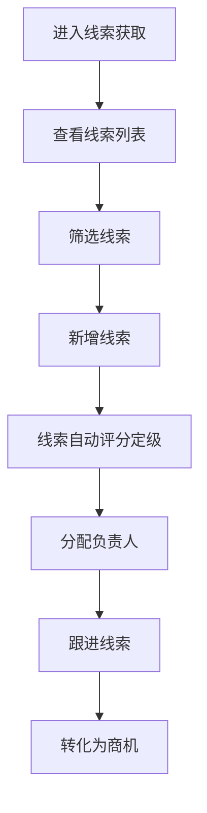

# 线索获取 PRD

## 需求背景
管理系统中的线索获取，支持线索的采集、录入和管理，是销售漏斗的入口。

## 前端页面描述
- 组件：LeadAcquisition
- 位置：作为页面内容显示

## 功能描述

### 页面布局
| 区域 | 组件 | 说明 |
|------|------|------|
| Tab切换 | 按钮组 | 线索列表/线索分级标准 |
| 统计卡片 | 卡片组 | 6个统计指标 |
| 操作区 | 按钮组 | 新增、导出、刷新 |
| 查询表单 | 表单 | 关键词、等级、状态筛选 |
| 数据表格 | 表格 | 15列线索列表 |

### Tab结构
| Tab名称 | 功能 |
|---------|------|
| 线索列表 | 展示线索数据列表 |
| 线索分级标准 | 配置线索分级评分规则 |

### 统计卡片（线索列表 Tab）
| 指标 | 说明 |
|------|------|
| 线索总数 | 当前线索总数 |
| A级线索 | A级线索数量 |
| B级线索 | B级线索数量 |
| C级线索 | C级线索数量 |
| 跟进中 | 跟进中的线索数 |
| 已转化 | 已转化为商机的数量 |

### 查询字段（线索列表 Tab）
| 字段名 | 类型 | 必填 | 默认值 | 说明 |
|--------|------|------|--------|------|
| 关键词 | Input | 否 | 空 | 搜索客户名称/线索编号/联系人 |
| 线索等级 | Select | 否 | 全部等级 | A级/B级/C级 |
| 线索状态 | Select | 否 | 全部状态 | 待分配/跟进中/已转化/已关闭 |

### 表格列（线索列表 - 15列）
| 列名 | 宽度 | 可排序 | 对齐 | 说明 |
|------|------|--------|------|------|
| 序号 | 60px | 否 | center | - |
| 线索编号 | 120px | 否 | center | - |
| 客户名称 | 180px | 否 | left | - |
| 联系人 | 100px | 否 | center | - |
| 联系电话 | 120px | 否 | center | - |
| 所属区域 | 100px | 否 | center | - |
| 线索来源 | 100px | 否 | center | Badge |
| 关联商情 | 120px | 否 | center | - |
| 预估金额 | 100px | 是 | right | 万元 |
| 线索等级 | 80px | 否 | center | Badge |
| 线索状态 | 100px | 否 | center | Badge |
| 负责人 | 100px | 否 | center | - |
| 跟进次数 | 80px | 否 | center | - |
| 创建时间 | 120px | 否 | center | - |
| 操作 | 100px | 否 | center | 查看/编辑 |

### 线索等级Badge
| 等级 | 颜色 | 说明 |
|------|------|------|
| A级 | 红色 | 高价值线索，优先跟进 |
| B级 | 橙色 | 中价值线索，正常跟进 |
| C级 | 黄色 | 低价值线索，储备跟进 |

### 线索状态Badge
| 状态值 | 颜色 | 说明 |
|--------|------|------|
| 待分配 | 橙色 | 线索待分配负责人 |
| 跟进中 | 蓝色 | 正在跟进中 |
| 已转化 | 绿色 | 已转化为商机 |
| 已关闭 | 灰色 | 已关闭 |

### 线索分级标准Tab
包含三个评分维度（潜在价值40%/紧急程度30%/需求匹配度30%），每维度分为高/中/低三档。

### 操作按钮
| 按钮名称 | 位置 | 样式 | 说明 |
|----------|------|------|------|
| 新增线索 | 操作区 | Primary | 打开新增线索弹窗 |
| 导出数据 | 操作区 | Outline | 导出线索数据 |
| 刷新 | 操作区 | Outline | 刷新列表 |
| 查看详情 | 表格操作列 | text | 查看线索详情 |
| 编辑 | 表格操作列 | text | 编辑线索信息 |

## 业务流程图

## 需求清单
| 序号 | 需求描述 | 优先级 | 状态 |
|------|----------|--------|------|
| 1 | 线索列表展示 | P0 | TODO |
| 2 | 线索分级标准配置 | P0 | TODO |
| 3 | 线索自动评分 | P0 | TODO |
| 4 | 新增线索 | P0 | TODO |
| 5 | 查看/编辑详情 | P1 | TODO |

## 验收标准
- [ ] 线索列表正确展示
- [ ] 统计卡片数据准确
- [ ] 筛选条件生效
- [ ] 线索分级标准可配置
- [ ] 新增/编辑功能正常

## 更新记录
### v1 - 2026/05/08
- 初始版本（字段级别细化）
