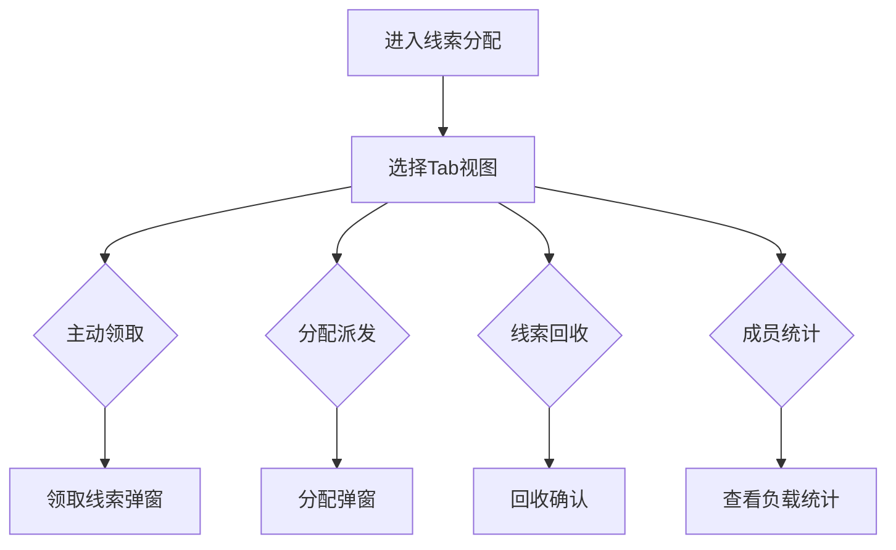

# 线索分配 PRD

## 需求背景
管理线索的领取、派发和回收，支持团队协作和线索资源优化配置。

## 前端页面描述
- 组件：LeadDistribution
- 位置：作为页面内容显示

## 功能描述

### 页面布局
| 区域 | 组件 | 说明 |
|------|------|------|
| Tab切换 | 按钮组 | 主动领取/分配派发/线索回收/成员统计 |
| 规则说明 | 卡片 | 展示领取规则 |
| 统计看板 | 卡片组 | 团队成员负载统计 |
| 数据表格 | 表格 | 对应Tab的列表数据 |
| 弹窗 | 弹窗组件 | 分配弹窗/领取弹窗 |

### Tab结构
| Tab名称 | 功能 |
|---------|------|
| 主动领取 | 从线索池中主动领取线索 |
| 分配派发 | 管理者将线索分配或派发给指定人员 |
| 线索回收 | 回收长期未跟进的线索 |
| 成员统计 | 展示团队成员线索负载统计 |

### 查询字段
| 字段名 | 类型 | 必填 | 默认值 | 说明 |
|--------|------|------|--------|------|
| 关键词 | Input | 否 | 空 | 搜索客户名称/线索编号 |
| 线索等级 | Select | 否 | 全部 | A级/B级/C级 |
| 时间范围 | DateRangePicker | 否 | 空 | - |

### 表格列
| 列名 | 宽度 | 可排序 | 对齐 | 说明 |
|------|------|--------|------|------|
| 序号 | 60px | 否 | center | - |
| 线索编号 | 120px | 否 | center | - |
| 客户名称 | 160px | 否 | left | - |
| 联系人 | 100px | 否 | center | - |
| 联系电话 | 120px | 否 | center | - |
| 线索等级 | 80px | 否 | center | Badge |
| 线索状态 | 100px | 否 | center | Badge |
| 负责人 | 100px | 否 | center | - |
| 领取时间 | 120px | 否 | center | - |
| 操作 | 120px | 否 | center | 领取/分配/回收 |

### 线索状态Badge
| 状态值 | 颜色 | 说明 |
|--------|------|------|
| 待领取 | 灰色 | 线索待领取 |
| 已领取 | 蓝色 | 线索已被人领取 |
| 已派发 | 紫色 | 线索已派发给指定人 |
| 已回收 | 橙色 | 线索已被回收 |

### 成员统计Tab
展示团队成员线索负载统计，包含：姓名、角色、待跟进数、跟进中数、已转化数、负载指数。

### 操作按钮
| 按钮名称 | 位置 | 样式 | 说明 |
|----------|------|------|------|
| 领取 | 表格操作列 | Primary | 打开领取确认弹窗 |
| 分配 | 表格操作列 | Outline | 打开分配弹窗 |
| 回收 | 表格操作列 | text | 回收线索 |
| 查看详情 | 表格操作列 | text | 查看线索详情 |

### 联动逻辑
1. 主动领取：显示可领取线索列表，点击领取后弹窗确认
2. 分配派发：管理者选择人员和线索，执行分配
3. 线索回收：按规则自动/手动回收超时未跟进的线索

## 业务流程图

## 需求清单
| 序号 | 需求描述 | 优先级 | 状态 |
|------|----------|--------|------|
| 1 | 四Tab切换 | P0 | TODO |
| 2 | 主动领取功能 | P0 | TODO |
| 3 | 分配派发功能 | P0 | TODO |
| 4 | 线索回收功能 | P0 | TODO |
| 5 | 成员负载统计 | P1 | TODO |

## 验收标准
- [ ] 四Tab正常切换
- [ ] 领取功能正常
- [ ] 分配功能正常
- [ ] 回收功能正常
- [ ] 成员统计准确

## 更新记录
### v1 - 2026/05/08
- 初始版本（字段级别细化）
