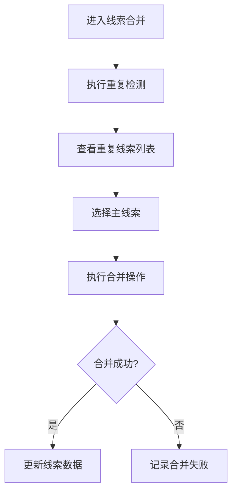

# 线索合并 PRD

## 需求背景
检测重复线索、管理线索合并、处理数据迁移，是线索质量管理的重要环节。

## 前端页面描述
- 组件：LeadMerge
- 位置：作为页面内容显示

## 功能描述

### 页面布局
| 区域 | 组件 | 说明 |
|------|------|------|
| Tab切换 | 按钮组 | 重复线索检测/合并管理/数据迁移配置 |
| 统计卡片 | 卡片组 | 展示检测统计结果 |
| 操作区 | 按钮组 | 执行检测/导出等 |
| 数据表格 | 表格 | 重复线索列表/合并记录 |
| 合并弹窗 | 弹窗 | 选择主线索执行合并 |

### Tab结构
| Tab名称 | 功能 |
|---------|------|
| 重复线索检测 | 检测系统中重复的线索，展示统计结果 |
| 合并管理 | 管理线索合并操作，支持选择主线索 |
| 数据迁移配置 | 配置数据迁移规则 |

### 查询字段
| 字段名 | 类型 | 必填 | 默认值 | 说明 |
|--------|------|------|--------|------|
| 检测规则 | Select | 否 | 全部 | 按客户名称/按联系方式/按公司税号 |
| 检测时间 | DateRangePicker | 否 | 空 | - |
| 处理状态 | Select | 否 | 全部 | 待处理/合并中/已合并/已驳回 |

### 表格列（重复线索检测/合并管理）
| 列名 | 宽度 | 可排序 | 对齐 | 说明 |
|------|------|--------|------|------|
| 序号 | 60px | 否 | center | - |
| 线索编号 | 120px | 否 | center | - |
| 客户名称 | 160px | 否 | left | - |
| 重复类型 | 100px | 否 | center | Badge |
| 重复数量 | 80px | 否 | center | - |
| 处理状态 | 100px | 否 | center | Badge |
| 创建时间 | 120px | 否 | center | - |
| 操作 | 120px | 否 | center | 查看/合并/驳回 |

### 处理状态Badge
| 状态值 | 颜色 | 说明 |
|--------|------|------|
| 待处理 | 灰色 | 重复线索待处理 |
| 合并中 | 蓝色 | 正在合并中 |
| 已合并 | 绿色 | 已成功合并 |
| 已驳回 | 红色 | 合并已驳回 |

### 重复类型Badge
| 类型 | 颜色 | 说明 |
|------|------|------|
| 客户名称重复 | 橙色 | 客户名称相同 |
| 联系方式重复 | 蓝色 | 联系方式相同 |
| 多重重复 | 红色 | 多种条件重复 |

### 操作按钮
| 按钮名称 | 位置 | 样式 | 说明 |
|----------|------|------|------|
| 执行检测 | 操作区 | Primary | 执行重复线索检测 |
| 导出数据 | 操作区 | Outline | 导出检测结果 |
| 刷新 | 操作区 | Outline | 刷新列表 |
| 查看详情 | 表格操作列 | text | 查看重复线索详情 |
| 开始合并 | 表格操作列 | Primary | 打开合并弹窗 |
| 驳回 | 表格操作列 | text | 驳回合并不处理 |

## 业务流程图

## 需求清单
| 序号 | 需求描述 | 优先级 | 状态 |
|------|----------|--------|------|
| 1 | 重复线索检测 | P0 | TODO |
| 2 | 合并管理 | P0 | TODO |
| 3 | 主线索选择 | P0 | TODO |
| 4 | 数据迁移配置 | P1 | TODO |

## 验收标准
- [ ] 重复检测结果准确
- [ ] 合并操作正常执行
- [ ] 主线索选择功能正常
- [ ] 配置保存成功

## 更新记录
### v1 - 2026/05/08
- 初始版本（字段级别细化）
