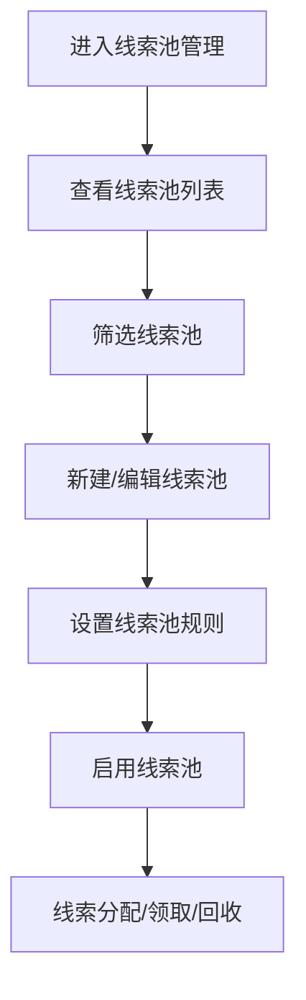

# 线索池管理 PRD

## 需求背景
管理系统中所有线索的池化运营，支持线索的分配、领取和回收，优化线索资源利用。

## 前端页面描述
- 组件：LeadPoolManagement
- 位置：作为页面内容显示

## 功能描述

### 页面布局
| 区域 | 组件 | 说明 |
|------|------|------|
| Tab切换 | 按钮组 | 线索池管理/权限管理/状态跟踪 |
| 统计卡片 | 卡片组 | 4个统计指标 |
| 操作区 | 按钮组 | 新建线索池、刷新 |
| 查询表单 | 表单 | 关键词、类型筛选 |
| 数据表格 | 表格 | 15列线索池列表 |

### Tab结构
| Tab名称 | 功能 |
|---------|------|
| 线索池管理 | 管理线索池列表 |
| 权限管理 | 展示三类权限说明 |
| 状态跟踪 | 展示状态流转规则和预警配置 |

### 统计卡片
| 指标 | 说明 |
|------|------|
| 线索池总数 | 当前线索池数量 |
| 线索总量 | 所有池内线索总数 |
| 跟进中 | 跟进中的线索数 |
| 已转化 | 已转化为商机的数量 |

### 查询字段（线索池管理 Tab）
| 字段名 | 类型 | 必填 | 默认值 | 说明 |
|--------|------|------|--------|------|
| 关键词 | Input | 否 | 空 | 搜索线索池名称、编码 |
| 线索池类型 | Select | 否 | 全部类型 | 区域/产品线/渠道/客户等级/业务阶段 |

### 表格列（线索池管理 - 15列）
| 列名 | 宽度 | 可排序 | 对齐 | 说明 |
|------|------|--------|------|------|
| 序号 | 60px | 否 | center | - |
| 线索池编号 | 120px | 否 | center | - |
| 线索池名称 | 160px | 否 | left | - |
| 类型 | 100px | 否 | center | Badge |
| 所属维度 | 100px | 否 | center | - |
| 线索总量 | 80px | 否 | center | - |
| 待分配 | 80px | 否 | center | - |
| 跟进中 | 80px | 否 | center | - |
| 已回收 | 80px | 否 | center | - |
| 已转化 | 80px | 否 | center | - |
| 已关闭 | 80px | 否 | center | - |
| 状态 | 80px | 否 | center | Badge |
| 创建时间 | 120px | 否 | center | - |
| 创建人 | 100px | 否 | center | - |
| 操作 | 100px | 否 | center | 查看/编辑/删除 |

### 线索池类型Badge
| 类型 | 颜色 | 说明 |
|------|------|------|
| 区域 | 蓝色 | 按区域分类 |
| 产品线 | 紫色 | 按产品线分类 |
| 渠道 | 绿色 | 按渠道分类 |
| 客户等级 | 橙色 | 按客户等级分类 |
| 业务阶段 | 红色 | 按业务阶段分类 |

### 线索池状态Badge
| 状态值 | 颜色 | 说明 |
|--------|------|------|
| 启用 | 绿色 | 线索池启用中 |
| 停用 | 灰色 | 线索池已停用 |

### 状态跟踪Tab内容
- 状态流转规则：待分配 → 跟进中 → 已转化/已回收/已关闭
- 线索池统计看板：待分配/跟进中/已回收/已转化/已关闭数量
- 预警提醒配置：待分配超时提醒（48小时）、跟进预警提醒（7天未跟进）

### 操作按钮
| 按钮名称 | 位置 | 样式 | 说明 |
|----------|------|------|------|
| 新建线索池 | 操作区 | Primary | 打开新建线索池弹窗 |
| 刷新 | 操作区 | Outline | 刷新列表 |
| 查看 | 表格操作列 | text | 查看线索池详情 |
| 编辑 | 表格操作列 | text | 编辑线索池信息 |
| 删除 | 表格操作列 | text | 删除线索池 |

## 业务流程图

## 需求清单
| 序号 | 需求描述 | 优先级 | 状态 |
|------|----------|--------|------|
| 1 | 线索池列表展示 | P0 | TODO |
| 2 | 线索池类型分类 | P0 | TODO |
| 3 | 新建/编辑线索池 | P0 | TODO |
| 4 | 权限管理说明 | P1 | TODO |
| 5 | 状态跟踪看板 | P1 | TODO |
| 6 | 预警提醒配置 | P1 | TODO |

## 验收标准
- [ ] 线索池列表正确展示
- [ ] 统计卡片数据准确
- [ ] 新建/编辑功能正常
- [ ] 权限说明清晰
- [ ] 状态跟踪正常

## 更新记录
### v1 - 2026/05/08
- 初始版本（字段级别细化）
