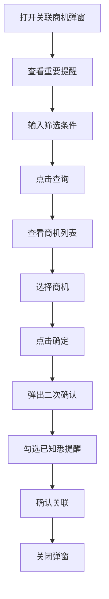

# 关联已有商机弹窗 PRD

## 需求背景
将商情与已有商机进行关联，需要展示重要提醒避免错误操作导致虚假商机。

## 前端页面描述
- 组件：LinkOpportunityDialog
- 位置：作为弹窗居中显示
- 宽度：800px
- 交互逻辑：
  1. 搜索筛选已有商机
  2. 选择商机后确认关联
  3. 确认时需勾选重要提醒

## 功能描述

### 页面布局
| 区域 | 组件 | 说明 |
|------|------|------|
| 标题栏 | h2 + 关闭按钮 | 显示"关联已有商机" |
| 重要提醒Banner | 黄色背景区域 | 提醒关联后注意事项，可关闭 |
| 搜索筛选区 | 输入框/下拉框 | 商机名称、客户名称等筛选 |
| 商机列表 | 表格 | 展示可选商机 |
| 底部操作 | 按钮组 | 取消/确定 |

### 查询条件
| 字段名 | 类型 | 默认值 | 必填 | 说明 |
|--------|------|--------|------|------|
| 商机名称 | Input | 空 | 否 | 模糊搜索 |
| 客户名称 | Input | 空 | 否 | 模糊搜索 |
| 关联状态 | Select | 空 | 否 | 全部/未关联/已关联 |
| 客户经理 | Input | 空 | 否 | 模糊搜索 |

### 表格/列表
| 列名 | 宽度 | 可筛选 | 对齐 | 说明 |
|------|------|--------|------|------|
| 选择 | 40px | 否 | center | 单选圆形按钮 |
| 商机名称/编码 | 200px | 否 | left | 上行名称，下行编码 |
| 客户名称 | 160px | 否 | left | 含客户编码 |
| 金额(万) | 80px | 否 | center | 橙色背景Badge |
| 创建时间 | 140px | 否 | left | - |
| 客户经理 | 140px | 否 | left | 含手机号 |
| 关联状态 | 80px | 否 | center | 已关联显示红色Badge |

### 操作按钮
| 按钮名称 | 位置 | 样式 | 说明 |
|----------|------|------|------|
| 查询 | 筛选区 | Primary，蓝底 | 执行筛选查询 |
| 重置 | 筛选区 | Outline | 清空筛选条件 |
| 取消 | 底部 | Outline | 关闭弹窗 |
| 确定 | 底部 | Primary，蓝底 | 确认关联，需先选择商机 |

### 重要提醒内容
商情中标前30天内请勿对关联的商机作以下两类修改（如强行修改，集团会判为虚假商机，算作漏单!!!）：
1. 客户名称变更
2. 商机名称+商机金额+客户需求同时变更

### 确认关联弹窗（二次确认）
- 标题：重要提醒
- 内容：再次展示重要提醒内容
- 复选框：勾选"我已知悉上述提醒"
- 按钮：取消 / 确认关联

### 联动逻辑
1. **选择商机后确定按钮可用**：未选择时禁用
2. **确认关联弹窗**：需勾选"我已知悉上述提醒"才能点击确认关联
3. **未勾选提醒复选框**：确认关联按钮禁用

## 业务流程图

## 状态Badge
| 状态值 | 颜色 | 说明 |
|--------|------|------|
| 已关联 | bg-red-100/text-red-700 | 红色，已关联的商机 |
| 金额 | bg-orange-100/text-orange-600 | 金额Badge |

## 提示信息
| 场景 | 类型 | 提示内容 |
|------|------|----------|
| 未选择商机 | warning | 确定按钮禁用提示 |
| 未勾选提醒 | warning | 确认关联按钮禁用提示 |
| 无匹配商机 | info | 显示"暂无匹配的商机" |

## 需求清单
| 序号 | 需求描述 | 优先级 | 状态 |
|------|----------|--------|------|
| 1 | 重要提醒Banner | P0 | DONE |
| 2 | 商机搜索筛选 | P0 | DONE |
| 3 | 商机列表展示 | P0 | DONE |
| 4 | 商机选择 | P0 | DONE |
| 5 | 二次确认弹窗 | P0 | DONE |
| 6 | 列宽拖动 | P2 | DONE |

## 验收标准
- [ ] 重要提醒正确显示
- [ ] 商机搜索筛选功能正常
- [ ] 商机列表正确展示
- [ ] 单选功能正常
- [ ] 二次确认弹窗正常
- [ ] 列宽可拖动调整

## 更新记录
### v1 - 2026/05/08
- 初始版本（字段级别细化）
