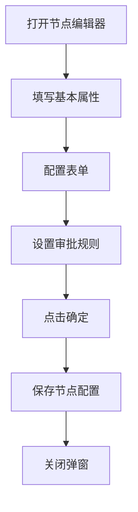

# 节点配置编辑器 PRD

## 需求背景
配置流程中单个节点的详细信息，包括节点属性、表单配置、审批规则等。

## 前端页面描述
- 组件：NodeEditor
- 位置：作为弹窗或抽屉显示

## 功能描述

### 页面布局
| 区域 | 组件 | 说明 |
|------|------|------|
| 标题栏 | h2 + 关闭按钮 | 节点名称 |
| 基本属性 | 表单 | 节点基本信息 |
| 表单配置 | 表单 | 节点关联的表单 |
| 审批规则 | 表单 | 审批人、审批条件 |
| 底部操作 | 按钮组 | - |

### 表单字段（基本属性）
| 字段名 | 类型 | 必填 | 默认值 | 说明 |
|--------|------|------|--------|------|
| 节点名称 | Input | 是 | 空 | - |
| 节点类型 | Select | 是 | 开始/中间/结束/判断 | - |
| 节点描述 | Textarea | 否 | 空 | - |
| 处理人 | Select | 是 | 空 | - |
| 处理时限 | number | 否 | 空 | 小时 |

### 表单字段（表单配置）
| 字段名 | 类型 | 必填 | 默认值 | 说明 |
|--------|------|------|--------|------|
| 表单选择 | Select | 是 | 空 | - |
| 必填字段 | Checkbox组 | 否 | 空 | - |
| 字段权限 | Checkbox组 | 否 | 空 | 只读/编辑 |

### 表单字段（审批规则）
| 字段名 | 类型 | 必填 | 默认值 | 说明 |
|--------|------|------|--------|------|
| 审批类型 | Select | 是 | 单人审批/会签/或签 | - |
| 审批人 | Select | 是 | 空 | - |
| 审批条件 | Textarea | 否 | 空 | 条件表达式 |

### 联动逻辑
1. **节点类型="判断"时**：显示审批条件字段
2. **审批类型="会签"时**：审批人可多选

### 操作按钮
| 按钮名称 | 样式 | 说明 |
|----------|------|------|
| 确定 | Primary | 保存并关闭 |
| 取消 | Outline | 关闭弹窗 |

## 业务流程图

## 需求清单
| 序号 | 需求描述 | 优先级 | 状态 |
|------|----------|--------|------|
| 1 | 基本属性配置 | P0 | TODO |
| 2 | 表单配置 | P0 | TODO |
| 3 | 审批规则配置 | P0 | TODO |
| 4 | 联动逻辑 | P1 | TODO |

## 验收标准
- [ ] 基本属性配置正确
- [ ] 表单配置功能正常
- [ ] 审批规则配置正确
- [ ] 联动逻辑正确
- [ ] 保存功能正常

## 更新记录
### v1 - 2026/05/08
- 初始版本（字段级别细化）
