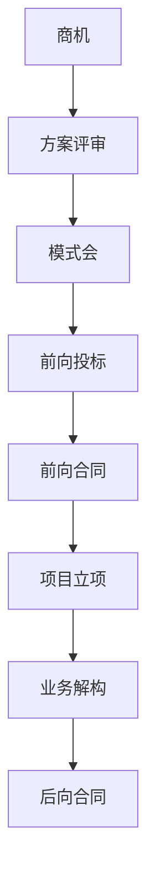

# 商机详情页 PRD

## 需求背景
展示商机的完整信息，包含售前、售中、资金三大视角，贯穿商机→方案评审→模式会→前向投标→前向合同→项目立项→业务解构→后向合同8步业务流程。

## 前端页面描述
- 组件：OpportunityDetail
- 位置：作为详情页显示

## 功能描述

### 页面布局
| 区域 | 组件 | 说明 |
|------|------|------|
| Tab切换 | 按钮组 | 售前视图/售中视图/资金视图 |
| 投标管理 | 卡片组 | 6种状态分类展示 |
| 资质证书管理 | 卡片/表格 | 资质证书列表 |
| 流程状态 | 步骤条 | 8步业务流程状态追踪 |
| 详情区块 | 卡片 | 各视角详细信息 |

### Tab结构
| Tab名称 | 功能 |
|---------|------|
| 售前视图 | 商机基础信息、方案评审、模式会等售前阶段数据 |
| 售中视图 | 前向投标、前向合同、项目立项等售中阶段数据 |
| 资金视图 | 业务解构、后向合同等资金相关数据 |

### 8步业务流程
| 步骤 | 状态 |
|------|------|
| 1. 商机 | 未开始/进行中/已完成 |
| 2. 方案评审 | 未开始/进行中/已完成 |
| 3. 模式会 | 未开始/进行中/已完成 |
| 4. 前向投标 | 未开始/进行中/已完成 |
| 5. 前向合同 | 未开始/进行中/已完成 |
| 6. 项目立项 | 未开始/进行中/已完成 |
| 7. 业务解构 | 未开始/进行中/已完成 |
| 8. 后向合同 | 未开始/进行中/已完成 |

### 投标管理卡片状态
| 状态 | 颜色 | 说明 |
|------|------|------|
| 中标 | 绿色 | 投标已中标 |
| 丢标 | 红色 | 投标未中标 |
| 弃标 | 灰色 | 主动放弃投标 |
| 已签约 | 蓝色 | 已签订合同 |
| 已取消 | 灰色 | 投标已取消 |
| 处理中 | 橙色 | 投标处理中 |

### 操作按钮
| 按钮名称 | 位置 | 样式 | 说明 |
|----------|------|------|------|
| 编辑 | 操作区 | Primary | 编辑商机信息 |
| 投标管理 | 操作区 | Outline | 进入投标管理 |
| 关联资质证书 | 操作区 | Outline | 管理资质证书 |
| 推进流程 | 操作区 | Primary | 推进到下一流程节点 |
| 返回 | 操作区 | Outline | 返回商机列表 |

### 联动逻辑
1. Tab切换联动详情内容变化
2. 投标状态变更联动流程状态更新
3. 资质证书上传/删除后刷新证书列表
4. 推进流程后自动更新8步流程状态

## 业务流程图

## 需求清单
| 序号 | 需求描述 | 优先级 | 状态 |
|------|----------|--------|------|
| 1 | 三级Tab售前/售中/资金视图 | P0 | TODO |
| 2 | 投标管理卡片 | P0 | TODO |
| 3 | 资质证书管理 | P1 | TODO |
| 4 | 8步流程状态展示 | P0 | TODO |
| 5 | 流程推进功能 | P0 | TODO |

## 验收标准
- [ ] 三级Tab正常切换
- [ ] 各视图数据正确展示
- [ ] 投标管理状态正确分类
- [ ] 8步流程状态准确
- [ ] 流程推进功能正常

## 更新记录
### v1 - 2026/05/08
- 初始版本（字段级别细化）
