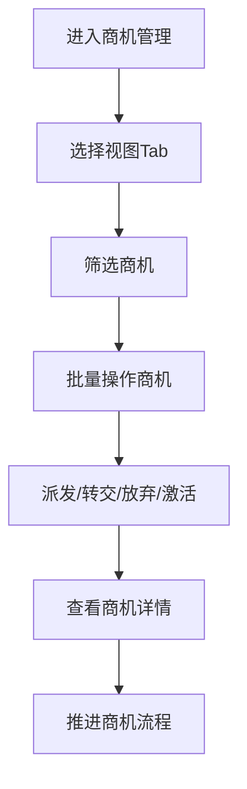

# 商机管理查询 PRD

## 需求背景
查询和管理商机信息，支持多视图展示和多维度筛选，是商机全生命周期管理的核心入口。

## 前端页面描述
- 组件：OpportunityQuery
- 位置：作为页面内容显示

## 功能描述

### 页面布局
| 区域 | 组件 | 说明 |
|------|------|------|
| 操作区 | 按钮组 | 新增、批量操作、导出、刷新 |
| 查询表单 | 表单 | 多维度筛选 |
| Tab切换 | 按钮组 | 我发起的/我管理的/我支撑的 |
| 数据表格 | FullFlowTable | 27列超宽表 |

### Tab结构
| Tab名称 | 功能 |
|---------|------|
| 我发起的 | 我发起的商机列表 |
| 我管理的 | 我管理的商机列表 |
| 我支撑的 | 我支撑的商机列表 |

### 查询字段
| 字段名 | 类型 | 必填 | 默认值 | 说明 |
|--------|------|------|--------|------|
| 商机名称 | Input | 否 | 空 | - |
| 商机编号 | Input | 否 | 空 | - |
| 省份 | Select | 否 | 全部 | - |
| 客户名称 | Input | 否 | 空 | - |
| 商机等级 | Select | 否 | 全部 | A级/B级/C级 |
| 商机状态 | Select | 否 | 全部 | 待处理/跟进中/已签约/已关闭 |
| 时间范围 | DateRangePicker | 否 | 空 | - |

### 表格列（27列）
| 列名 | 宽度 | 可排序 | 对齐 | 说明 |
|------|------|--------|------|------|
| 序号 | 60px | 否 | center | - |
| 商机编号 | 120px | 否 | center | - |
| 商机名称 | 200px | 否 | left | - |
| 省份 | 80px | 否 | center | - |
| 客户名称 | 160px | 否 | left | - |
| 商机金额 | 120px | 是 | right | 万元 |
| 商机等级 | 80px | 否 | center | Badge |
| 商机状态 | 100px | 否 | center | Badge |
| 销售模式 | 100px | 否 | center | Badge |
| 负责人 | 100px | 否 | center | - |
| 创建时间 | 120px | 否 | center | - |
| 跟进时间 | 120px | 否 | center | - |
| 操作 | 120px | 否 | center | 查看详情 |

### 商机等级Badge
| 等级 | 颜色 | 说明 |
|------|------|------|
| A | 红色 | 重点商机，优先跟进 |
| B | 橙色 | 主要商机，正常跟进 |
| C | 蓝色 | 一般商机 |

### 商机状态Badge
| 状态值 | 颜色 | 说明 |
|--------|------|------|
| 待处理 | 灰色 | 商机待处理 |
| 跟进中 | 蓝色 | 正在跟进中 |
| 已签约 | 绿色 | 已签约落地 |
| 已关闭 | 灰色 | 已关闭 |

### 批量操作按钮
| 按钮名称 | 说明 |
|----------|------|
| 派发 | 批量派发商机 |
| 转交 | 批量转交商机 |
| 放弃 | 批量放弃商机 |
| 激活 | 批量激活商机 |

### 操作按钮
| 按钮名称 | 位置 | 样式 | 说明 |
|----------|------|------|------|
| 新增商机 | 操作区 | Primary | 打开新增商机弹窗 |
| 批量派发 | 操作区 | Outline | 批量派发商机 |
| 批量转交 | 操作区 | Outline | 批量转交商机 |
| 导出数据 | 操作区 | Outline | 导出商机数据 |
| 刷新 | 操作区 | Outline | 刷新列表 |
| 查看详情 | 表格操作列 | text | 进入商机详情页 |

## 业务流程图

## 需求清单
| 序号 | 需求描述 | 优先级 | 状态 |
|------|----------|--------|------|
| 1 | 多视图Tab切换 | P0 | TODO |
| 2 | 27列超宽表格展示 | P0 | TODO |
| 3 | 状态筛选 | P0 | TODO |
| 4 | 批量操作功能 | P1 | TODO |
| 5 | 详情查看 | P0 | TODO |

## 验收标准
- [ ] 多视图Tab正确切换
- [ ] 表格正确展示27列数据
- [ ] 筛选条件生效
- [ ] 批量操作正常执行
- [ ] 点击行可查看详情

## 更新记录
### v1 - 2026/05/08
- 初始版本（字段级别细化）
