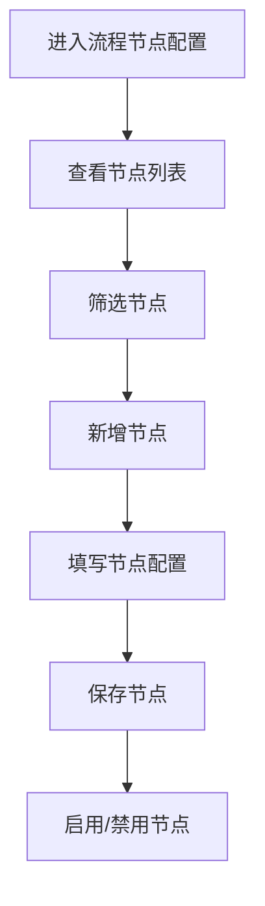

# 流程节点配置 PRD

## 需求背景
管理系统中各类流程节点，支持流程的查看、配置和管理，是整个LTO系统的流程引擎管理入口。

## 前端页面描述
- 组件：NodeList / NodeConfigEditor
- 位置：作为页面内容显示

## 功能描述

### 页面布局
| 区域 | 组件 | 说明 |
|------|------|------|
| Tab切换 | 按钮组 | 流程列表/节点列表 |
| 查询区 | 表单 | 节点名称、区域、类型、阶段等筛选 |
| 操作区 | 按钮组 | 查询、重置、新增节点 |
| 数据表格 | 表格 | 10列节点列表 |
| 编辑器 | NodeConfigEditor | 新增/编辑节点配置 |

### Tab结构
| Tab名称 | 功能 |
|---------|------|
| 流程列表 | 展示所有已配置的流程（暂用节点列表替代） |
| 节点列表 | 展示所有节点，支持节点级别的配置操作 |

### 查询字段（节点列表 Tab）
| 字段名 | 类型 | 必填 | 默认值 | 说明 |
|--------|------|------|--------|------|
| 节点名称 | Input | 否 | 空 | - |
| 适用区域 | Input | 否 | 空 | - |
| 业务类型 | Input | 否 | 空 | - |
| 阶段 | Input | 否 | 空 | - |

### 表格列（节点列表 - 10列）
| 列名 | 宽度 | 对齐 | 说明 |
|------|------|------|------|
| 节点名称 | 120px | left | - |
| 节点编码 | 120px | center | - |
| 节点描述 | 200px | left | - |
| 页面数量 | 80px | center | - |
| 适用区域 | 100px | left | - |
| 业务类型 | 100px | left | - |
| 阶段 | 100px | left | - |
| 类型 | 100px | left | Badge |
| 状态 | 80px | center | 按钮切换 |
| 操作 | 100px | center | 编辑/删除 |

### 节点类型Badge
| 类型 | 颜色 | 说明 |
|------|------|------|
| 业务流 | 蓝色 | 业务相关流程节点 |
| 财务流 | 绿色 | 财务相关流程节点 |

### 状态切换
| 状态 | 颜色 | 说明 |
|------|------|------|
| 已启用 | 绿色 | 节点启用中 |
| 已禁用 | 灰色 | 节点已禁用 |

### 操作按钮
| 按钮名称 | 位置 | 样式 | 说明 |
|----------|------|------|------|
| 查询 | 操作区 | Outline | 执行筛选查询 |
| 重置 | 操作区 | Outline | 重置筛选条件 |
| 新增节点 | 操作区 | Primary | 打开节点配置编辑器 |
| 编辑 | 表格操作列 | text | 打开节点配置编辑器 |
| 删除 | 表格操作列 | text | 删除节点 |

### 联动逻辑
1. Tab切换联动表格数据
2. 状态切换即时生效
3. 编辑后保存刷新列表

## 业务流程图

## 需求清单
| 序号 | 需求描述 | 优先级 | 状态 |
|------|----------|--------|------|
| 1 | 节点列表展示 | P0 | TODO |
| 2 | 查询筛选 | P0 | TODO |
| 3 | 新增节点 | P0 | TODO |
| 4 | 编辑节点 | P0 | TODO |
| 5 | 启用/禁用 | P1 | TODO |

## 验收标准
- [ ] 节点列表正确展示
- [ ] 查询筛选功能正常
- [ ] 新增/编辑节点功能正常
- [ ] 启用/禁用切换正常

## 更新记录
### v1 - 2026/05/08
- 初始版本（字段级别细化）
