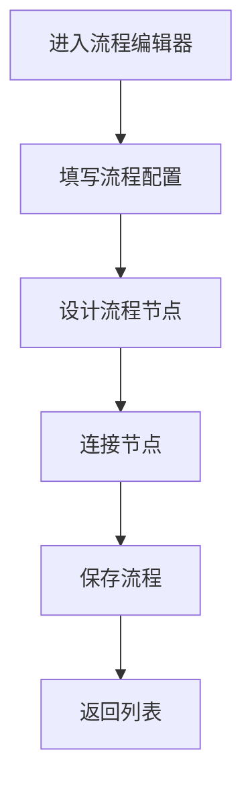

# 流程编辑器 PRD

## 需求背景
创建和编辑流程配置，支持可视化流程设计。

## 前端页面描述
- 组件：ProcessEditor
- 位置：作为子视图显示

## 功能描述

### 页面布局
| 区域 | 组件 | 说明 |
|------|------|------|
| 流程配置区 | 表单 | 基本配置信息 |
| 节点配置区 | 画布 | 可视化节点编辑 |
| 底部操作 | 按钮组 | 保存/取消 |

### 表单字段（流程配置）
| 字段名 | 类型 | 必填 | 默认值 | 说明 |
|--------|------|------|--------|------|
| 流程名称 | Input | 是 | 空 | - |
| 流程类型 | Select | 是 | 空 | - |
| 描述 | Textarea | 否 | 空 | - |
| 关联项目 | Select | 否 | 空 | - |

### 节点配置
| 功能 | 说明 |
|------|------|
| 新增节点 | 在画布上新增节点 |
| 编辑节点 | 双击或右键编辑节点 |
| 删除节点 | 右键删除节点 |
| 连接节点 | 拖拽连接线连接节点 |
| 节点类型 | 开始/中间/结束/判断 |

### 操作按钮
| 按钮名称 | 样式 | 说明 |
|----------|------|------|
| 保存 | Primary | 保存流程配置 |
| 取消 | Outline | 取消并返回 |

## 业务流程图

## 需求清单
| 序号 | 需求描述 | 优先级 | 状态 |
|------|----------|--------|------|
| 1 | 流程配置表单 | P0 | TODO |
| 2 | 节点可视化编辑 | P0 | TODO |
| 3 | 节点连接 | P1 | TODO |
| 4 | 保存功能 | P0 | TODO |

## 验收标准
- [ ] 流程配置表单正确展示
- [ ] 节点可视化编辑正常
- [ ] 节点连接功能正常
- [ ] 保存功能正常

## 更新记录
### v1 - 2026/05/08
- 初始版本（字段级别细化）
