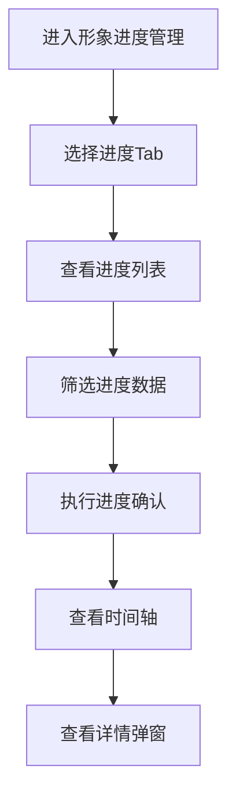

# 形象进度管理 PRD

## 需求背景
管理项目形象进度，包含收入、支出、收款、付款四个维度的进度确认，是项目执行监控的核心功能。

## 前端页面描述
- 组件：ProgressManagement
- 位置：作为页面内容显示

## 功能描述

### 页面布局
| 区域 | 组件 | 说明 |
|------|------|------|
| Tab切换 | 按钮组 | 收入进度/支出进度/收款进度/付款进度 |
| 操作区 | 按钮组 | 导出、刷新 |
| 查询表单 | 表单 | 多维度筛选 |
| 数据表格 | 表格 | 16列进度确认表格 |
| 时间轴 | 组件 | 财务进度时间轴 |
| 详情弹窗 | FinancialProgressDetailDialog | 财务进度详情 |

### Tab结构
| Tab名称 | 功能 |
|---------|------|
| 收入进度 | 展示收入确认进度，支持进度确认操作 |
| 支出进度 | 展示成本支出进度，支持进度确认操作 |
| 收款进度 | 展示收款确认进度，支持收款确认 |
| 付款进度 | 展示付款确认进度，支持付款确认 |

### 查询字段
| 字段名 | 类型 | 必填 | 默认值 | 说明 |
|--------|------|------|--------|------|
| 项目名称 | Input | 否 | 空 | - |
| 省份 | Select | 否 | 全部 | - |
| 确认状态 | Select | 否 | 全部 | 待确认/已确认/已驳回 |
| 时间范围 | DateRangePicker | 否 | 空 | - |

### 表格列（16列）
| 列名 | 宽度 | 可排序 | 对齐 | 说明 |
|------|------|--------|------|------|
| 序号 | 60px | 否 | center | - |
| 项目编号 | 120px | 否 | center | - |
| 项目名称 | 200px | 否 | left | - |
| 省份 | 80px | 否 | center | - |
| 合同金额 | 120px | 是 | right | 万元 |
| 计划进度 | 100px | 否 | center | 百分比 |
| 实际进度 | 100px | 否 | center | 百分比 |
| 进度偏差 | 100px | 是 | right | 百分比 |
| 确认金额 | 120px | 是 | right | 万元 |
| 确认比例 | 100px | 是 | center | 百分比 |
| 确认状态 | 100px | 否 | center | Badge |
| 确认人 | 100px | 否 | center | - |
| 确认时间 | 120px | 否 | center | - |
| 时间轴 | 120px | 否 | center | 查看时间轴 |
| 操作 | 100px | 否 | center | 确认/详情 |

### 确认状态Badge
| 状态值 | 颜色 | 说明 |
|--------|------|------|
| 待确认 | 灰色 | 待确认进度 |
| 已确认 | 绿色 | 进度已确认 |
| 已驳回 | 红色 | 进度被驳回 |

### 操作按钮
| 按钮名称 | 位置 | 样式 | 说明 |
|----------|------|------|------|
| 查询 | 操作区 | Primary | 执行筛选查询 |
| 重置 | 操作区 | Outline | 重置筛选条件 |
| 导出数据 | 操作区 | Outline | 导出进度数据 |
| 刷新 | 操作区 | Outline | 刷新列表 |
| 确认 | 表格操作列 | Primary | 打开确认弹窗 |
| 查看时间轴 | 表格操作列 | text | 查看财务进度时间轴 |
| 查看详情 | 表格操作列 | text | 打开详情弹窗 |

### 联动逻辑
1. Tab切换联动表格列和数据变化
2. 确认状态变更联动表格刷新
3. 查看时间轴展示里程碑进度
4. 详情弹窗展示多Tab财务数据

## 业务流程图

## 需求清单
| 序号 | 需求描述 | 优先级 | 状态 |
|------|----------|--------|------|
| 1 | 四Tab进度切换 | P0 | TODO |
| 2 | 16列进度表格 | P0 | TODO |
| 3 | 财务进度时间轴 | P1 | TODO |
| 4 | 进度确认功能 | P0 | TODO |
| 5 | 财务进度详情弹窗 | P0 | TODO |

## 验收标准
- [ ] 四Tab正常切换
- [ ] 16列表格正确展示
- [ ] 时间轴正确显示
- [ ] 进度确认功能正常
- [ ] 详情弹窗正常

## 更新记录
### v1 - 2026/05/08
- 初始版本（字段级别细化）
