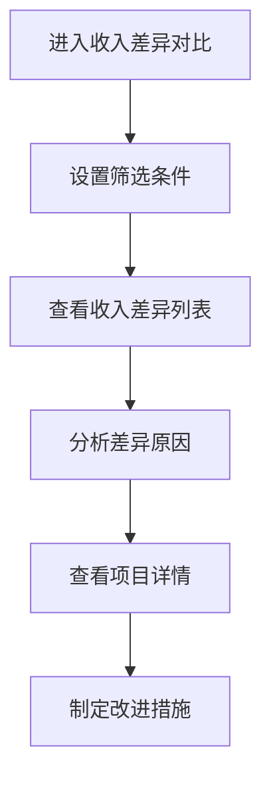

# 收入计划与实际确收差异 PRD

## 需求背景
对比项目收入计划与实际确收金额的差异，帮助管理者了解收入达成情况。

## 前端页面描述
- 组件：RevenuePlanActualDiff
- 位置：作为页面内容显示

## 功能描述

### 页面布局
| 区域 | 组件 | 说明 |
|------|------|------|
| 查询区 | ReportTemplate | 通用模板筛选 |
| 操作区 | 按钮组 | 导出、刷新 |
| 数据表格 | 表格 | 展示计划与实际差异 |

### 查询字段
| 字段名 | 类型 | 必填 | 默认值 | 说明 |
|--------|------|------|--------|------|
| 项目名称 | Input | 否 | 空 | - |
| 省份 | Select | 否 | 全部 | - |
| 项目类型 | Select | 否 | 全部 | - |
| 时间范围 | DateRangePicker | 否 | 当前年度 | - |
| 对比维度 | Select | 否 | 年度 | 月度/季度/年度 |

### 表格列
| 列名 | 宽度 | 可排序 | 对齐 | 说明 |
|------|------|--------|------|------|
| 序号 | 60px | 否 | center | - |
| 项目编号 | 120px | 否 | center | - |
| 项目名称 | 200px | 否 | left | - |
| 省份 | 80px | 否 | center | - |
| 计划收入 | 120px | 是 | right | 万元 |
| 实际确收 | 120px | 是 | right | 万元 |
| 差异金额 | 120px | 是 | right | 万元 |
| 完成率 | 100px | 是 | center | 百分比 |
| 状态 | 100px | 否 | center | Badge |
| 操作 | 100px | 否 | center | 查看详情 |

### 状态Badge
| 状态值 | 颜色 | 说明 |
|--------|------|------|
| 超额完成 | 绿色 | 实际超过计划 |
| 正常完成 | 蓝色 | 按计划完成 |
| 未完成 | 红色 | 未达计划 |
| 进行中 | 灰色 | 尚未截止 |

### 操作按钮
| 按钮名称 | 位置 | 样式 | 说明 |
|----------|------|------|------|
| 查询 | 操作区 | Primary | 执行筛选查询 |
| 重置 | 操作区 | Outline | 重置筛选条件 |
| 导出数据 | 操作区 | Outline | 导出差异数据 |
| 刷新 | 操作区 | Outline | 刷新列表 |
| 查看详情 | 表格操作列 | text | 查看详情 |

### 联动逻辑
1. 对比维度切换联动表格列变化
2. 计划与实际差异自动计算
3. 完成率联动状态判定

## 业务流程图

## 需求清单
| 序号 | 需求描述 | 优先级 | 状态 |
|------|----------|--------|------|
| 1 | 收入差异对比展示 | P0 | TODO |
| 2 | 多条件筛选 | P0 | TODO |
| 3 | 对比维度切换 | P0 | TODO |
| 4 | 详情查看 | P1 | TODO |

## 验收标准
- [ ] 正确展示计划与实际差异
- [ ] 筛选条件生效
- [ ] 对比维度正常切换
- [ ] 差异计算准确

## 更新记录
### v1 - 2026/05/08
- 初始版本（字段级别细化）
