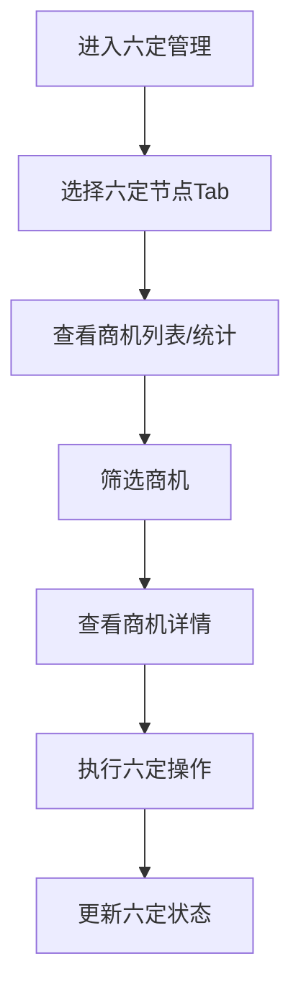

# 六定管理 PRD

## 需求背景
六定管理是对商机全生命周期进行精细化管控的核 心功能模块，通过"定人、定级、定时、定量、定钱、定果"六个维度，实现商机的精准管理和资源的最优配置。

## 前端页面描述
- 组件：SixPositioning
- 位置：作为独立页面显示

## 功能描述

### 页面布局
| 区域 | 组件 | 说明 |
|------|------|------|
| 操作区 | 按钮组 | 新增、筛选、重置 |
| Tab切换 | 按钮组 | 列表/统计 |
| 六定节点 | 分类卡片组 | 17个节点分6类展示 |
| 表格 | FullFlowTable | 全流程102列宽表 |

### Tab结构
| Tab名称 | 功能 |
|---------|------|
| 列表 | 以表格形式展示商机 |
| 统计 | 以统计图形式展示商机 |

### 查询字段（列表 Tab）
| 字段名 | 类型 | 必填 | 默认值 | 说明 |
|--------|------|------|--------|------|
| 六定节点 | Select | 否 | 全部 | 17个六定节点 |
| 省份 | Select | 否 | 全部 | - |
| 客户名称 | Input | 否 | 空 | - |
| 商机名称 | Input | 否 | 空 | - |
| 时间范围 | DateRangePicker | 否 | 最近90天 | - |
| 六定状态 | Select | 否 | 全部 | - |
| 负责人 | Select | 否 | 全部 | - |

### 六定节点分类
| 分类 | 节点 |
|------|------|
| 线索类 | 线索获取、线索清洗、线索分配 |
| 商机类 | 商机录入、商机评审、商机转换 |
| 投标类 | 投标准备、投标评审、投标执行 |
| 合同类 | 合同谈判、合同签订、合同生效 |
| 执行类 | 执行监控、验收交付 |
| 回款类 | 回款管理 |

### 表格列（列表 Tab）
| 列名 | 宽度 | 可排序 | 对齐 | 说明 |
|------|------|--------|------|------|
| 序号 | 60px | 否 | center | - |
| 六定节点 | 120px | 否 | center | Badge |
| 商机名称 | 200px | 否 | left | - |
| 省份 | 80px | 否 | center | - |
| 客户名称 | 160px | 否 | left | - |
| 商机金额 | 120px | 是 | right | 万元 |
| 商机等级 | 80px | 否 | center | Badge |
| 负责人 | 100px | 否 | center | - |
| 计划时间 | 120px | 否 | center | - |
| 实际时间 | 120px | 否 | center | - |
| 六定状态 | 100px | 否 | center | Badge |
| 操作 | 120px | 否 | center | 查看详情 |

### 六定状态Badge
| 状态值 | 颜色 | 说明 |
|--------|------|------|
| 未开始 | 灰色 | 商机未开始处理 |
| 进行中 | 蓝色 | 商机正在处理 |
| 已完成 | 绿色 | 商机已完成 |
| 已超时 | 红色 | 商机已超时 |

### 商机等级Badge
| 等级 | 颜色 | 说明 |
|------|------|------|
| A | 红色 | 重点商机 |
| B | 橙色 | 主要商机 |
| C | 蓝色 | 一般商机 |

### 操作按钮
| 按钮名称 | 位置 | 样式 | 说明 |
|----------|------|------|------|
| 新增 | 操作区 | Primary | 打开新增商机弹窗 |
| 筛选 | 操作区 | Primary | 展开/收起筛选条件 |
| 重置 | 操作区 | Outline | 重置筛选条件 |
| 查看详情 | 表格操作列 | text | 进入商机详情页 |

### 联动逻辑
1. Tab切换时，表格列配置相应变化
2. 六定节点筛选联动六定状态筛选
3. 省份筛选联动客户名称联想

## 业务流程图

## 需求清单
| 序号 | 需求描述 | 优先级 | 状态 |
|------|----------|--------|------|
| 1 | 六定节点分类展示 | P0 | TODO |
| 2 | 列表/统计Tab切换 | P0 | TODO |
| 3 | 查询筛选功能 | P0 | TODO |
| 4 | FullFlowTable集成 | P0 | TODO |
| 5 | 统计图表展示 | P1 | TODO |

## 验收标准
- [ ] 六定节点分类正确展示
- [ ] 列表/统计Tab切换正常
- [ ] 查询筛选功能正确
- [ ] FullFlowTable正确展示
- [ ] 统计图表正确展示

## 更新记录
### v1 - 2026/05/08
- 初始版本（字段级别细化）
