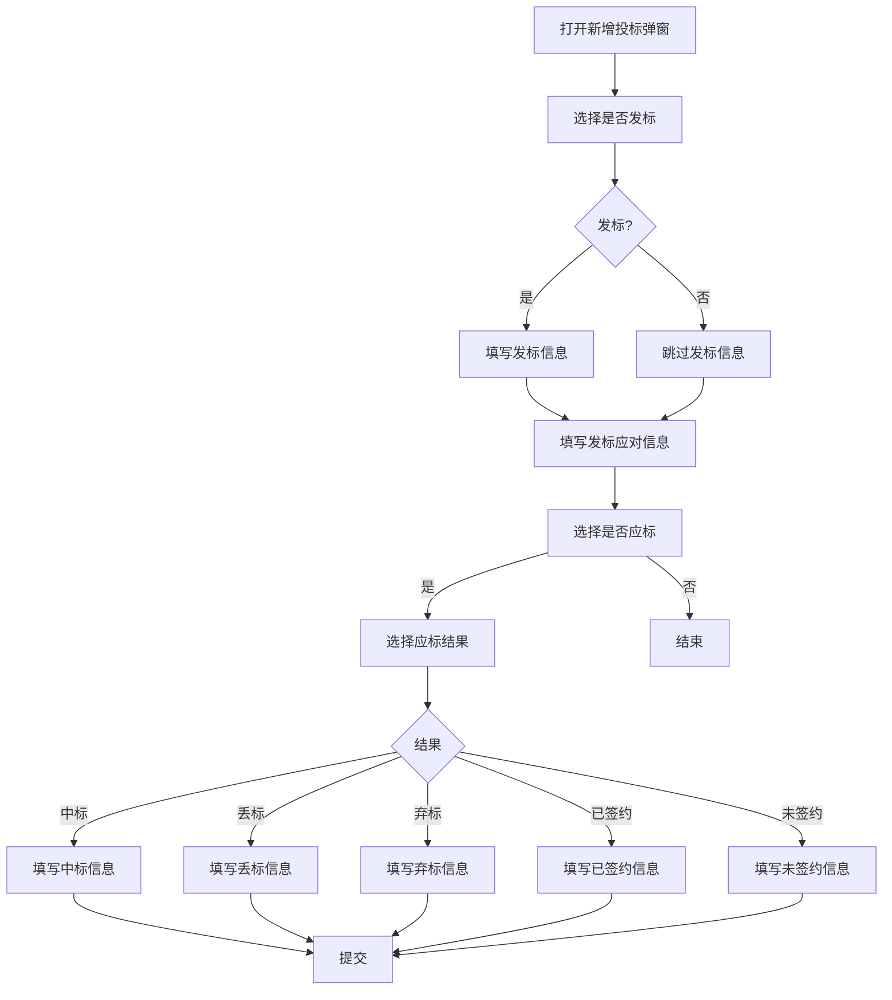

# 新增投标维护弹窗 PRD

## 需求背景
管理投标信息维护，支持发标、应标、中标、丢标、弃标等多种投标状态的信息录入。

## 前端页面描述
- 组件：AddBidDialog
- 位置：作为弹窗全屏或最大化显示
- 宽度：900px / 全屏
- 交互逻辑：
  1. 动态表单，根据发标/应标状态显示不同字段
  2. 支持全屏切换
  3. 支持暂存和提交

## 功能描述

### 页面布局
| 区域 | 组件 | 说明 |
|------|------|------|
| 标题栏 | h2 + 全屏/关闭按钮 | 蓝色背景标题栏 |
| 表单区 | 滚动容器 | 动态表单内容 |
| 底部操作 | 按钮组 | 取消/暂存/提交 |

### 表单字段（发标信息区块）
| 字段名 | 类型 | 必填 | 默认值 | 联动条件 | 说明 |
|--------|------|------|--------|----------|------|
| 是否发标 | Select | 是 | 空 | - | 是/否 |
| 发标类型 | Select | 条件必填 | 空 | isStart="1"时必填 | 公开招标/邀请招标/竞争性谈判/单一来源采购/询价/直接签约 |
| 发标时间 | date | 条件必填 | 空 | isStart="1"时必填 | - |
| 招标文件/招标公告 | FileUpload | 条件必填 | 空 | isStart="1"时必填 | 支持pdf/word/excel |

### 表单字段（发标应对信息区块）
| 字段名 | 类型 | 必填 | 默认值 | 说明 |
|--------|------|------|--------|------|
| 投标主体 | Input | 是 | 空 | - |
| 预计合作伙伴 | Input | 是 | 空 | - |
| 是否应标 | Radio | 是 | 空 | 是/否 |
| 标前会议决策记录 | FileUpload | 是 | 空 | - |

### 表单字段（应标信息区块，isBid="1"时显示）
| 字段名 | 类型 | 必填 | 默认值 | 说明 |
|--------|------|------|--------|------|
| 应标结果 | Select | 是 | 空 | 中标/丢标/未开标/已签约/未签约/弃标 |

### 表单字段（中标信息区块，bidResult="1"时显示）
| 字段名 | 类型 | 必填 | 默认值 | 说明 |
|--------|------|------|--------|------|
| 投标时间 | date | 是 | 空 | - |
| 中标金额（万元） | Input | 是 | 空 | - |
| 中标时间 | date | 是 | 空 | - |
| 签约对象 | Input | 是 | 空 | - |
| 客户项目联系人 | Input | 是 | 空 | - |
| 客户项目联系方式 | Input | 是 | 空 | - |
| 项目期望完成时间 | date | 否 | 空 | - |
| 中标通知书 | FileUpload | 否 | 空 | - |

### 表单字段（已签约信息区块，bidResult="4"时显示）
| 字段名 | 类型 | 必填 | 默认值 | 说明 |
|--------|------|------|--------|------|
| 商务谈判时间 | date | 否 | 空 | - |
| 客户项目联系人 | Input | 是 | 空 | - |
| 客户项目联系方式 | Input | 是 | 空 | - |
| 项目期望完成时间 | date | 否 | 空 | - |

### 表单字段（丢标信息区块，bidResult="2"时显示）
| 字段名 | 类型 | 必填 | 默认值 | 说明 |
|--------|------|------|--------|------|
| 投标时间 | date | 是 | 空 | - |
| 丢标原因 | Select | 是 | 空 | 8个预设原因+其他 |
| 其他丢标原因 | Input | 条件必填 | 空 | loseReason="8"时必填 |

### 表单字段（弃标信息区块，bidResult="6"时显示）
| 字段名 | 类型 | 必填 | 默认值 | 说明 |
|--------|------|------|--------|------|
| 是否完成弃标审批 | Select | 是 | 空 | 是/否 |
| 弃标审批人 | Input | 是 | 空 | - |
| 审批人人力编码 | Input | 是 | 空 | - |
| 审批人手机号 | Input | 否 | 空 | - |
| 审批人角色 | Select | 是 | 空 | 部门经理/行业总裁/领导/其他 |
| 弃标审批结果 | Select | 是 | 空 | 未审批/审核通过/已退回/未通过 |
| 弃标原因 | Select | 是 | 空 | 9个预设原因+其他 |
| 弃标审批发起时间 | date | 是 | 空 | - |
| 弃标审批通过时间 | date | 是 | 空 | - |

### 表单字段（未签约信息区块，bidResult="5"时显示）
| 字段名 | 类型 | 必填 | 默认值 | 说明 |
|--------|------|------|--------|------|
| 签约失败原因 | Select | 是 | 空 | 客户需求变更或取消/丢单/其他 |
| 其他签约失败原因 | Input | 条件必填 | 空 | failResult="3"时必填 |

### 操作按钮
| 按钮名称 | 位置 | 样式 | 说明 |
|----------|------|------|------|
| 取消 | 底部 | Outline | 关闭弹窗 |
| 暂存 | 底部 | Outline | 保存当前数据 |
| 提交 | 底部 | Primary，蓝底 | 提交表单并关闭 |
| 全屏切换 | 标题栏 | icon button | 切换全屏/普通模式 |

### 联动逻辑
1. **是否发标="否"时**：发标类型、发标时间、招标文件变为非必填
2. **是否发标="是"时**：发标类型、发标时间、招标文件变为必填
3. **是否应标="否"时**：应标结果、投标依据/标书不显示
4. **是否应标="是"时**：显示应标结果、投标依据/标书字段
5. **应标结果="中标"时**：显示中标信息区块
6. **应标结果="已签约"时**：显示已签约信息区块
7. **应标结果="丢标"时**：显示丢标信息区块
8. **应标结果="弃标"时**：显示弃标信息区块
9. **应标结果="未签约"时**：显示未签约信息区块
10. **丢标原因="其他"时**：显示其他丢标原因输入框

## 业务流程图

## 状态Badge
| 状态值 | 说明 |
|--------|------|
| 中标 | bidResult="1" |
| 丢标 | bidResult="2" |
| 未开标 | bidResult="3" |
| 已签约 | bidResult="4" |
| 未签约 | bidResult="5" |
| 弃标 | bidResult="6" |

## 提示信息
| 场景 | 类型 | 提示内容 |
|------|------|----------|
| 必填提示 | warning | 红色星号标记的字段为必填 |
| 文件格式 | info | 支持pdf/word/excel格式 |

## 需求清单
| 序号 | 需求描述 | 优先级 | 状态 |
|------|----------|--------|------|
| 1 | 发标信息表单 | P0 | DONE |
| 2 | 发标应对信息表单 | P0 | DONE |
| 3 | 应标结果动态显示 | P0 | DONE |
| 4 | 中标信息表单 | P1 | DONE |
| 5 | 丢标信息表单 | P1 | DONE |
| 6 | 弃标信息表单 | P1 | DONE |
| 7 | 文件上传功能 | P0 | DONE |
| 8 | 全屏切换 | P2 | DONE |

## 验收标准
- [ ] 发标信息表单必填校验正常
- [ ] 动态显示/隐藏区块正确
- [ ] 文件上传功能正常
- [ ] 暂存功能正常
- [ ] 提交功能正常
- [ ] 全屏切换正常

## 更新记录
### v1 - 2026/05/08
- 初始版本（字段级别细化）
