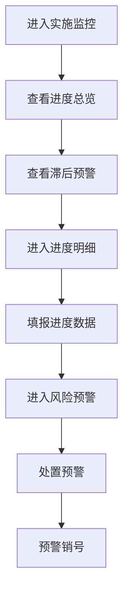

# 实施进度监控 PRD

## 需求背景
监控项目实施过程，跟踪项目执行进度和质量，是项目管理的重要环节。

## 前端页面描述
- 组件：ImplementationMonitoring
- 位置：作为页面内容显示

## 功能描述

### 页面布局
| 区域 | 组件 | 说明 |
|------|------|------|
| Tab切换 | 按钮组 | 进度总览/进度明细/风险预警 |
| 统计卡片 | 卡片组 | 6个核心指标 |
| 图表区 | recharts组件 | 甘特图/部门排名/偏差分布/趋势图 |
| 查询表单 | 表单 | 多维度筛选 |
| 数据表格 | 表格 | 进度明细/预警列表 |

### Tab结构
| Tab名称 | 功能 |
|---------|------|
| 进度总览 | 核心指标+图表+滞后预警清单 |
| 进度明细 | 详细进度数据和筛选 |
| 风险预警 | 风险预警统计和处置 |

### 统计卡片
| 指标 | 说明 |
|------|------|
| 项目总数 | 当前监控项目总数 |
| 正常推进 | 进度正常的项目数 |
| 滞后项目 | 进度滞后的项目数 |
| 里程碑总数 | 所有项目里程碑总数 |
| 已达成数 | 已达成的里程碑数 |
| 达成率 | 里程碑达成百分比 |

### 查询字段（进度明细 Tab）
| 字段名 | 类型 | 必填 | 默认值 | 说明 |
|--------|------|------|--------|------|
| 项目名称 | Input | 否 | 空 | - |
| 项目经理 | Input | 否 | 空 | - |
| 风险等级 | Select | 否 | 全部 | 正常/一般/较大/重大 |
| 时间范围 | DateRangePicker | 否 | 空 | - |

### 表格列（进度明细 - 9列）
| 列名 | 宽度 | 可排序 | 对齐 | 说明 |
|------|------|--------|------|------|
| 项目名称 | 200px | 否 | left | - |
| 项目经理 | 100px | 否 | center | - |
| 实际进度 | 120px | 否 | center | 百分比+进度条 |
| 计划进度 | 100px | 否 | center | 百分比 |
| 进度偏差 | 100px | 是 | right | 百分比 |
| 滞后里程碑 | 120px | 否 | center | - |
| 滞后时长 | 100px | 否 | center | 天数 |
| 风险等级 | 100px | 否 | center | Badge |
| 操作 | 100px | 否 | center | 详情/填报 |

### 风险等级Badge
| 等级 | 颜色 | 说明 |
|------|------|------|
| 正常 | 绿色 | 进度正常 |
| 一般 | 蓝色 | 存在一般风险 |
| 较大 | 橙色 | 存在较大风险 |
| 重大 | 红色 | 存在重大风险 |

### 风险预警Tab
预警级别：严重预警（红色）/ 重要预警（橙色）/ 一般预警（黄色）/ 已处理（绿色）
预警类型：进度延误/质量问题/资源风险/需求变更/成本超支/沟通问题/文档缺失

### 操作按钮
| 按钮名称 | 位置 | 样式 | 说明 |
|----------|------|------|------|
| 批量导出 | 操作区 | Outline | 导出进度数据 |
| 导出甘特图 | 操作区 | Outline | 导出甘特图 |
| 刷新 | 操作区 | Outline | 刷新列表 |
| 新增预警 | 操作区 | Primary | 新增预警记录 |
| 详情 | 表格操作列 | text | 查看进度详情 |
| 填报 | 表格操作列 | text | 填报进度数据 |
| 处置 | 预警表格 | text | 处置预警 |
| 销号 | 预警表格 | text | 预警销号 |

## 业务流程图

## 需求清单
| 序号 | 需求描述 | 优先级 | 状态 |
|------|----------|--------|------|
| 1 | 进度总览图表 | P0 | TODO |
| 2 | 进度明细表格 | P0 | TODO |
| 3 | 风险预警管理 | P0 | TODO |
| 4 | 进度填报 | P1 | TODO |
| 5 | 甘特图导出 | P1 | TODO |

## 验收标准
- [ ] 核心指标卡片数据准确
- [ ] 图表正确展示
- [ ] 滞后预警清单正确
- [ ] 进度明细表格正常
- [ ] 风险预警处置正常

## 更新记录
### v1 - 2026/05/08
- 初始版本（字段级别细化）
