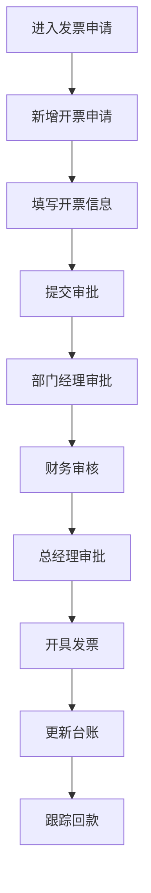

# 发票申请 PRD

## 需求背景
管理发票申请流程，处理发票开具和寄送，是财务收款的重要环节。

## 前端页面描述
- 组件：InvoiceApplication
- 位置：作为页面内容显示

## 功能描述

### 页面布局
| 区域 | 组件 | 说明 |
|------|------|------|
| Tab切换 | 按钮组 | 开票申请/开票台账 |
| 统计卡片 | 卡片组 | 金额统计 |
| 操作区 | 按钮组 | 新增、导出、刷新 |
| 查询表单 | 表单 | 关键词、状态筛选 |
| 数据表格 | 表格 | 13列开票申请列表/14列台账列表 |

### Tab结构
| Tab名称 | 功能 |
|---------|------|
| 开票申请 | 展示开票申请列表，支持新增、编辑、详情 |
| 开票台账 | 展示开票台账，记录发票和回款情况 |

### 统计卡片（开票申请 Tab）
| 指标 | 说明 |
|------|------|
| 累计申请金额 | 所有申请单总金额 |
| 已开票金额 | 已开具发票总金额 |

### 统计卡片（开票台账 Tab）
| 指标 | 说明 |
|------|------|
| 合同总金额 | 所有合同总金额 |
| 累计开票金额 | 已开票总金额 |
| 开票完成率 | 开票金额/合同金额百分比 |
| 累计回款金额 | 已回款总金额 |
| 回款率 | 回款金额/开票金额百分比 |
| 未回款金额 | 待回款金额 |

### 查询字段（开票申请 Tab）
| 字段名 | 类型 | 必填 | 默认值 | 说明 |
|--------|------|------|--------|------|
| 关键词 | Input | 否 | 空 | 搜索项目名称/编号、合同编号、申请单编号 |
| 申请状态 | Select | 否 | 全部 | 待提交/审批中/已驳回/已审批/开票中/已开票/已作废 |

### 表格列（开票申请 - 13列）
| 列名 | 宽度 | 可排序 | 对齐 | 说明 |
|------|------|--------|------|------|
| 序号 | 60px | 否 | center | - |
| 申请单编号 | 120px | 否 | center | - |
| 项目编号 | 120px | 否 | center | - |
| 项目名称 | 180px | 否 | left | - |
| 合同编号 | 120px | 否 | center | - |
| 申请开票金额 | 120px | 是 | right | 万元 |
| 对应付款节点 | 120px | 否 | center | - |
| 申请人 | 100px | 否 | center | - |
| 申请时间 | 120px | 否 | center | - |
| 申请状态 | 100px | 否 | center | Badge |
| 审批进度 | 100px | 否 | center | - |
| 发票号码 | 120px | 否 | center | - |
| 操作 | 100px | 否 | center | 查看/编辑 |

### 表格列（开票台账 - 14列）
| 列名 | 宽度 | 可排序 | 对齐 | 说明 |
|------|------|--------|------|------|
| 序号 | 60px | 否 | center | - |
| 项目名称 | 180px | 否 | left | - |
| 合同编号 | 120px | 否 | center | - |
| 申请单编号 | 120px | 否 | center | - |
| 发票号码 | 120px | 否 | center | - |
| 开票日期 | 120px | 否 | center | - |
| 开票金额 | 120px | 是 | right | 万元 |
| 税率 | 80px | 否 | center | - |
| 对应付款节点 | 120px | 否 | center | - |
| 回款状态 | 100px | 否 | center | Badge |
| 已回款金额 | 120px | 是 | right | 万元 |
| 未回款金额 | 120px | 是 | right | 万元 |
| 回款日期 | 120px | 否 | center | - |
| 操作 | 100px | 否 | center | 详情 |

### 申请状态Badge
| 状态值 | 颜色 | 说明 |
|--------|------|------|
| 待提交 | 灰色 | 待提交审批 |
| 审批中 | 蓝色 | 审批进行中 |
| 已驳回 | 红色 | 审批被驳回 |
| 已审批 | 绿色 | 审批已通过 |
| 开票中 | 橙色 | 发票开具中 |
| 已开票 | 绿色 | 发票已开具 |
| 已作废 | 灰色 | 发票已作废 |

### 回款状态Badge
| 状态值 | 颜色 | 说明 |
|--------|------|------|
| 未回款 | 红色 | 尚未回款 |
| 部分回款 | 橙色 | 部分已回款 |
| 已回款 | 绿色 | 全部已回款 |

### 新增/编辑表单字段
| 字段名 | 类型 | 必填 | 默认值 | 说明 |
|--------|------|------|--------|------|
| 项目编号 | Input | 是 | 空 | - |
| 项目名称 | Input | 是 | 空 | - |
| 合同编号 | Input | 是 | 空 | - |
| 合同金额 | Input | 否 | 空 | 万元 |
| 申请开票金额 | Input | 是 | 空 | 万元 |
| 对应付款节点 | Input | 否 | 空 | - |
| 发票类型 | Select | 是 | 增值税专用发票 | - |
| 税率 | Select | 是 | 6% | - |
| 购买方名称 | Input | 是 | 空 | - |
| 购买方税号 | Input | 是 | 空 | - |
| 购买方地址 | Input | 否 | 空 | - |
| 购买方电话 | Input | 否 | 空 | - |
| 购买方开户银行 | Input | 否 | 空 | - |
| 购买方银行账号 | Input | 否 | 空 | - |
| 备注 | Textarea | 否 | 空 | - |

### 操作按钮
| 按钮名称 | 位置 | 样式 | 说明 |
|----------|------|------|------|
| 新增开票申请 | 操作区 | Primary | 打开新增申请表单 |
| 批量导出 | 操作区 | Outline | 导出申请数据 |
| 导出台账 | 操作区（台账Tab） | Outline | 导出开票台账 |
| 刷新 | 操作区 | Outline | 刷新列表 |
| 保存草稿 | 表单 | Outline | 保存为草稿 |
| 提交申请 | 表单 | Primary | 提交审批 |
| 查看 | 表格操作列 | text | 查看申请详情 |
| 编辑 | 表格操作列 | text | 编辑申请 |
| 返回列表 | 详情页 | Outline | 返回列表页 |

### 联动逻辑
1. 开票申请状态联动审批进度显示
2. 已开票状态显示发票号码字段
3. 台账Tab联动回款统计卡片
4. 发票类型选择联动税率选项

## 业务流程图

## 需求清单
| 序号 | 需求描述 | 优先级 | 状态 |
|------|----------|--------|------|
| 1 | 开票申请列表展示 | P0 | TODO |
| 2 | 新增/编辑开票申请 | P0 | TODO |
| 3 | 申请审批流程 | P0 | TODO |
| 4 | 开票台账管理 | P0 | TODO |
| 5 | 申请详情查看 | P0 | TODO |

## 验收标准
- [ ] 开票申请列表正确展示
- [ ] 新增/编辑功能正常
- [ ] 审批流程正确执行
- [ ] 开票台账数据准确
- [ ] 详情页正常展示

## 更新记录
### v1 - 2026/05/08
- 初始版本（字段级别细化）
