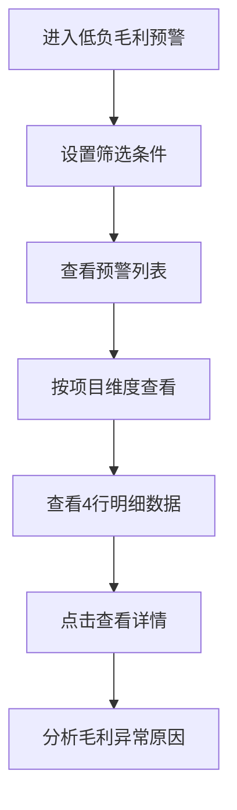

# 项目低负毛利预警 PRD

## 需求背景
监控项目中毛利率过低或为负的情况，帮助财务人员及时发现风险项目，按概算、预算、结算、决算四个维度分析。

## 前端页面描述
- 组件：LowMarginReport
- 位置：作为页面内容显示

## 功能描述

### 页面布局
| 区域 | 组件 | 说明 |
|------|------|------|
| 查询区 | 表单 | 多维度筛选 |
| 操作区 | 按钮组 | 导出、刷新 |
| 数据表格 | FullFlowTable | 每项目4行（概算/预算/结算/决算） |
| 详情弹窗 | ReportDetailModal | 查看详情 |

### 查询字段
| 字段名 | 类型 | 必填 | 默认值 | 说明 |
|--------|------|------|--------|------|
| 项目名称 | Input | 否 | 空 | - |
| 省份 | Select | 否 | 全部 | - |
| 模式会编号 | Input | 否 | 空 | - |
| 合同签约方 | Input | 否 | 空 | - |
| 预警级别 | Select | 否 | 全部 | 预警/危险/正常 |
| 时间范围 | DateRangePicker | 否 | 空 | - |

### 表格列
| 列名 | 宽度 | 可排序 | 对齐 | 说明 |
|------|------|--------|------|------|
| 序号 | 60px | 否 | center | - |
| 项目编号 | 120px | 否 | center | - |
| 项目名称 | 200px | 否 | left | - |
| 省份 | 80px | 否 | center | - |
| 概算毛利 | 100px | 是 | right | 百分比 |
| 预算毛利 | 100px | 是 | right | 百分比 |
| 结算毛利 | 100px | 是 | right | 百分比 |
| 决算毛利 | 100px | 是 | right | 百分比 |
| 预警级别 | 100px | 否 | center | Badge |
| 负责人 | 100px | 否 | center | - |
| 操作 | 100px | 否 | center | 查看详情 |

### 预警级别Badge
| 状态值 | 颜色 | 说明 |
|--------|------|------|
| 正常 | 绿色 | 毛利率正常 |
| 预警 | 橙色 | 毛利率偏低 |
| 危险 | 红色 | 毛利率为负或严重偏低 |

### 操作按钮
| 按钮名称 | 位置 | 样式 | 说明 |
|----------|------|------|------|
| 查询 | 操作区 | Primary | 执行筛选查询 |
| 重置 | 操作区 | Outline | 重置筛选条件 |
| 导出数据 | 操作区 | Outline | 导出预警数据 |
| 刷新 | 操作区 | Outline | 刷新列表 |
| 查看详情 | 表格操作列 | text | 打开详情弹窗 |

### 联动逻辑
1. 预警级别筛选联动表格数据
2. 按项目维度展示4行数据（概算/预算/结算/决算）
3. 毛利率计算联动预警级别判定

## 业务流程图

## 需求清单
| 序号 | 需求描述 | 优先级 | 状态 |
|------|----------|--------|------|
| 1 | 低负毛利数据表格 | P0 | TODO |
| 2 | 多维度筛选 | P0 | TODO |
| 3 | 每项目4行数据展示 | P0 | TODO |
| 4 | 详情弹窗 | P1 | TODO |
| 5 | 预警级别判定 | P0 | TODO |

## 验收标准
- [ ] 表格正确展示低毛利数据
- [ ] 每项目4行数据正确
- [ ] 筛选条件生效
- [ ] 预警级别正确判定
- [ ] 详情弹窗正常

## 更新记录
### v1 - 2026/05/08
- 初始版本（字段级别细化）
