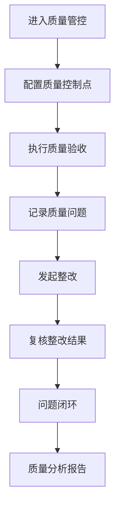

# 质量管控 PRD

## 需求背景
管理项目质量管控，跟踪质量检查和质量评估，是项目验收的重要环节。

## 前端页面描述
- 组件：QualityControl
- 位置：作为页面内容显示

## 功能描述

### 页面布局
| 区域 | 组件 | 说明 |
|------|------|------|
| Tab切换 | 按钮组 | 质量控制点/质量验收/问题整改/质量分析 |
| 统计卡片 | 卡片组 | 5个核心指标 |
| 查询表单 | 表单 | 多维度筛选 |
| 数据表格 | 表格 | 控制点/验收/问题列表 |
| 图表区 | recharts组件 | 质量分析图表 |

### Tab结构
| Tab名称 | 功能 |
|---------|------|
| 质量控制点 | 配置和管理质量控制点 |
| 质量验收 | 质量验收流程管理 |
| 问题整改 | 质量问题整改跟踪 |
| 质量分析 | 质量数据分析和图表 |

### 统计卡片
| 指标 | 说明 |
|------|------|
| 验收控制点总数 | 当前控制点数量 |
| 一次验收合格率 | 首次验收通过百分比 |
| 质量问题总数 | 当前质量问题数 |
| 问题闭环整改率 | 已闭环问题占总数百分比 |
| 重大问题数量 | 重大等级问题数 |

### 查询字段（质量控制点 Tab）
| 字段名 | 类型 | 必填 | 默认值 | 说明 |
|--------|------|------|--------|------|
| 关键词 | Input | 否 | 空 | 搜索项目名称、控制点名称 |
| 控制点状态 | Select | 否 | 全部 | 未启用/待验收/已验收/已作废 |

### 表格列（质量控制点 - 10列）
| 列名 | 宽度 | 可排序 | 对齐 | 说明 |
|------|------|--------|------|------|
| 序号 | 60px | 否 | center | - |
| 控制点编号 | 120px | 否 | center | - |
| 控制点名称 | 160px | 否 | left | - |
| 所属项目 | 180px | 否 | left | - |
| 对应里程碑 | 120px | 否 | center | - |
| 控制点等级 | 100px | 否 | center | Badge |
| 验收标准 | 200px | 否 | left | - |
| 验收主体 | 100px | 否 | center | - |
| 状态 | 100px | 否 | center | Badge |
| 操作 | 100px | 否 | center | 查看/编辑/验收 |

### 控制点等级Badge
| 等级 | 颜色 | 说明 |
|------|------|------|
| 一级 | 红色 | 关键控制点 |
| 二级 | 橙色 | 重要控制点 |
| 三级 | 蓝色 | 一般控制点 |

### 控制点状态Badge
| 状态值 | 颜色 | 说明 |
|--------|------|------|
| 未启用 | 灰色 | 控制点未启用 |
| 待验收 | 蓝色 | 待执行验收 |
| 已验收 | 绿色 | 已通过验收 |
| 已作废 | 灰色 | 控制点已作废 |

### 验收Tab
验收类型：里程碑验收/阶段验收/最终验收/专项验收
验收状态：待验收/验收中/已通过/未通过

### 问题整改Tab
问题等级：一般/较大/重大
整改状态：待整改/整改中/待复核/已闭环/已超期

### 操作按钮
| 按钮名称 | 位置 | 样式 | 说明 |
|----------|------|------|------|
| 新增控制点 | 操作区 | Primary | 新增质量控制点 |
| 导入模板 | 操作区 | Outline | 导入控制点模板 |
| 批量导出 | 操作区 | Outline | 导出控制点数据 |
| 刷新 | 操作区 | Outline | 刷新列表 |
| 查看 | 表格操作列 | text | 查看详情 |
| 编辑 | 表格操作列 | text | 编辑控制点 |
| 验收 | 表格操作列 | Primary | 执行验收 |

## 业务流程图

## 需求清单
| 序号 | 需求描述 | 优先级 | 状态 |
|------|----------|--------|------|
| 1 | 质量控制点管理 | P0 | TODO |
| 2 | 质量验收管理 | P0 | TODO |
| 3 | 问题整改跟踪 | P0 | TODO |
| 4 | 质量分析图表 | P1 | TODO |
| 5 | 导出报表 | P1 | TODO |

## 验收标准
- [ ] 质量控制点正确配置
- [ ] 验收流程正常执行
- [ ] 问题整改跟踪准确
- [ ] 质量分析图表正确
- [ ] 导出功能正常

## 更新记录
### v1 - 2026/05/08
- 初始版本（字段级别细化）
